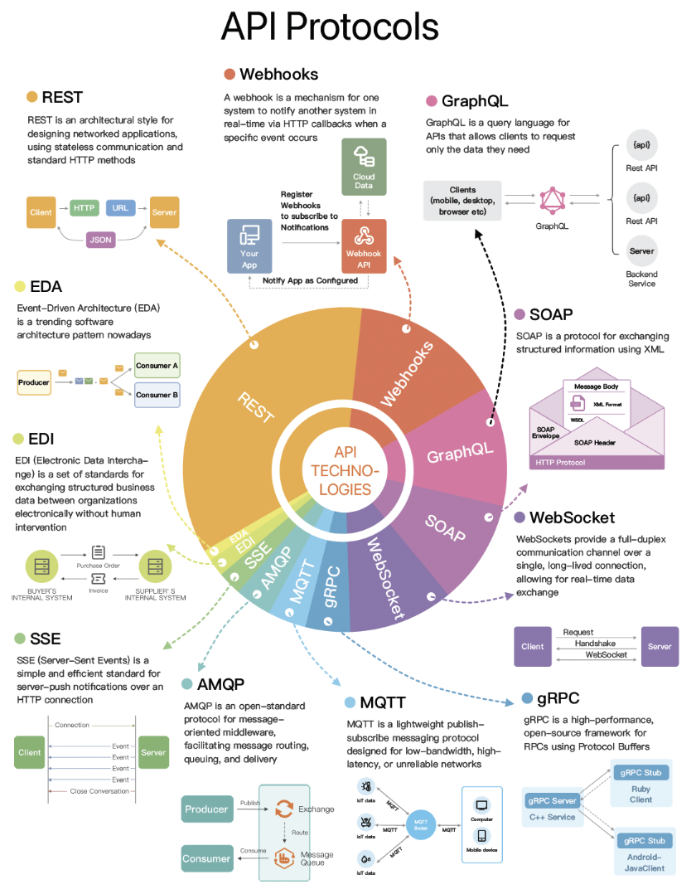
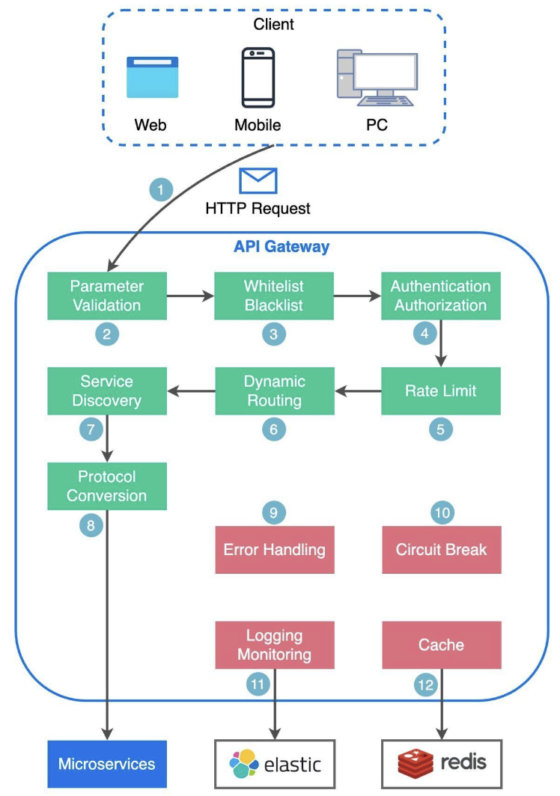

An **API** — application programming interface — is a contract between two pieces of software: one offers data or functionality, the other consumes it, and the API defines the shape of every request and response in between. That's the whole idea, and it's the reason a mobile app can use Google Maps, a shop can take Stripe payments, and a monolith can be broken into services that still work together.

The interesting parts are the choices. There isn't one way to build an API — there are several distinct styles with real trade-offs — and once you've built one, making it fast and keeping it secure are their own disciplines. This post is a map of all of that: the styles, the performance levers, the security baseline, and the gateway that sits in front.

## Why APIs matter

- **Microservices** — you can only split a system into independently deployable services if they have clean interfaces to talk over.
- **Integration** — systems built in different languages, by different companies, connect through APIs.
- **Reuse** — one API backs a web app, a mobile app, and a partner's integration.
- **Ecosystems** — a public API lets outsiders build things you didn't plan for.

## The styles

**REST** is the default for web and mobile APIs: stateless requests over standard HTTP methods (`GET`, `POST`, `PUT`, `DELETE`), resources identified by URLs, responses usually in JSON. Its constraints — client-server, stateless, cacheable, layered, uniform interface — are what make it scale and cache well. The [six REST constraints and how to design one](/citadel/interview/rest-api) go deeper.

**GraphQL** (Meta, 2012; public 2015) is a query language plus a typed schema. The client asks for exactly the fields it needs, across multiple resources, in one request — collapsing what REST would make several round trips. It has queries (reads), mutations (writes), and subscriptions (real-time push). It shines when data is graph-shaped, when clients are bandwidth-constrained, or when the frontend's data needs change often. [More on GraphQL](/citadel/interview/graphql).

**gRPC** (Google) is high-performance RPC: you call a method on a remote server as if it were local. It serialises with Protocol Buffers instead of JSON — smaller and roughly 5× faster to encode — and rides HTTP/2, so it gets multiplexing and bidirectional streaming. Its niche is internal service-to-service communication, IoT, and polyglot environments. [More on gRPC](/citadel/interview/grpc).

**Webhooks** invert the direction: instead of you polling a service for changes, the service makes an HTTP request to a URL you registered when an event happens — a payment succeeds, a commit lands. Event-driven and asynchronous. [More on webhooks](/citadel/interview/webhook).

**WebSocket** is a full-duplex channel over one long-lived TCP connection. After an HTTP handshake upgrades the connection, client and server push messages freely with no per-message HTTP overhead. For live chat, games, trading screens.

**SOAP** is an older XML-only protocol with a rigid enveloped message format. Still found in enterprise, financial, and [identity](/citadel/interview/identity-management) systems and legacy integrations.

Then the eventing protocols: **MQTT**, a lightweight pub/sub protocol for constrained devices on unreliable networks (IoT, sensors); **AMQP**, an open standard for message-oriented middleware with brokers and exchanges for complex routing (enterprise, finance); **SSE (Server-Sent Events)**, one-way server-to-client push over plain HTTP (news feeds, live scores); and **EDI**, decades-old standards for exchanging business documents like purchase orders and invoices between organisations (B2B, supply chain, healthcare).

## Making an API fast

Amazon found every 100 ms of added latency cost about 1% in sales, which is the general case for why this matters.

- **Pagination.** Never return an unbounded list. *Offset* pagination (`offset` + `limit`) is simple but slow at large offsets; *cursor* pagination passes an opaque marker and stays fast at any depth; *keyset* pagination filters on an indexed key; *time-based* suits time-ordered data.
- **Asynchronous logging.** Write log lines to a lock-free ring buffer and return immediately; flush to disk on a background thread, off the request path.
- **Caching.** Put frequently read data in [a cache like Redis](/citadel/interview/caching) and check it before the database.
- **Payload compression.** gzip requests and responses to cut transfer time.
- **Connection pooling.** Opening a database connection per request is expensive; keep a pool of open ones and reuse them.
- **Efficient protocols internally.** Prefer gRPC over verbose JSON for hot internal paths.

## The security baseline

- **HTTPS everywhere.** Encrypt everything in transit — no exceptions. [How HTTPS works](/citadel/interview/https).
- **Authentication.** Verify the caller: API keys, token auth ([JWT](/citadel/interview/jwt)), or OAuth 2.0. Issue separate key pairs for different scopes (read-only vs read-write).
- **Authorization.** Being authenticated isn't being allowed — check permission for the specific action.
- **Input validation.** Validate every incoming field, strictly.
- **Rate limiting.** Cap request frequency per user, per IP, per action group, to blunt abuse and protect the backend.
- **HMAC request signing.** For high-assurance APIs, have the client sign a string built from the app ID, request URI, body, method, a timestamp, and a nonce with the secret key — proving integrity and stopping replay.
- **Sane errors and status codes.** Return [meaningful HTTP status codes](/citadel/interview/http-codes) and descriptive error messages that don't leak internal detail. Document with OpenAPI/Swagger. The full picture is in [securing a web API](/citadel/interview/secure-web-api).

Also: version from day one (`/v1/`, `/v2/`) so you can change without breaking callers; make `PUT` and `DELETE` idempotent so retries are safe; give clients filtering and sorting so they can ask for less.

## The API gateway

Once you have many services, letting clients call each one directly is a mess — every service re-implements auth, rate limiting, and logging, and clients need to know the whole topology. An **API gateway** is a single entry point that handles the cross-cutting concerns. A request through it goes roughly:

1. Parse and do basic validation.
2. Check IP allow/deny lists.
3. **Authenticate and authorize** — often against an identity provider, so individual services don't have to.
4. **Rate limit.**
5. **Route** — match the path and use [service discovery](/citadel/interview/load-balancing) (Eureka, Consul) to find a healthy instance.
6. **Translate protocol** if needed — external REST/JSON to internal gRPC.
7. Forward to the backend, or **compose** — call several services and merge their responses into one.
8. Transform the response, **cache** it if cacheable, log metrics (often to an ELK stack).
9. Handle backend failure with **circuit breaking** so one sick service doesn't cascade.

The cost: the gateway is a network hop and a potential single point of failure, so it has to be run highly available, and its routing config grows complex.

### Gateway vs load balancer

They overlap but aren't the same. A [load balancer](/citadel/interview/load-balancing) spreads traffic across many instances of *the same* service, at layer 4 or 7, for scale and availability. A gateway is a layer-7 component that routes to *different* services and adds composition, auth, rate limiting, and protocol translation. In practice a load balancer sits in front of several gateway instances, which route to services that may each have their own internal load balancer. Related: [forward and reverse proxies](/citadel/interview/proxies).

## API vs SDK

An API is the contract; an **SDK** is a toolkit — libraries, sample code, docs — that wraps an API for a specific platform and handles the boilerplate (auth, request formatting, retries). The analogy the source draws: an API is a restaurant menu telling you what you can order and what you'll get; an SDK is a fully stocked kitchen for one cuisine. When a provider offers both, most developers use the SDK and let it make the API calls underneath.

## The takeaway

Pick the style from the traffic: REST for public web APIs, GraphQL when clients need flexible reads, gRPC for internal hot paths, webhooks and SSE for push. Performance is a handful of standard levers — pagination, caching, pooling, compression. Security has a baseline you don't get to skip — TLS, auth, validation, rate limiting. And a gateway is worth its complexity once you have enough services that they'd otherwise each reinvent all of that.
