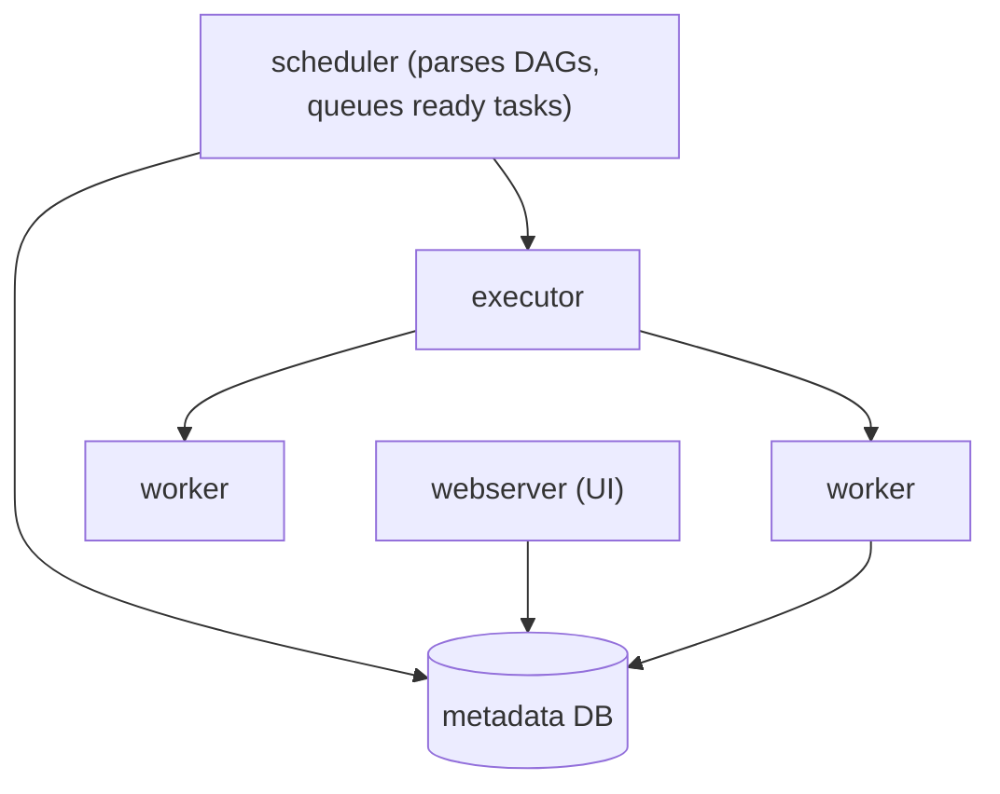

A data pipeline is rarely one script. It's "pull yesterday's events from the API, load them into the warehouse, run three transformations that depend on the load, then refresh a dashboard and email a report — and if the API call fails, retry it, and if I fix a bug I need to re-run last week." Cron gives you exactly one primitive: start a command at a time. Everything else — dependencies, retries, backfills, visibility into what ran and why it failed — you'd build by hand.

**Airflow** is the tool that provides those. It models a pipeline as a **DAG** — a directed acyclic graph of tasks — written in Python, and runs it on a schedule with dependency ordering, retries, and a web UI. The concepts are straightforward; the discipline it forces (idempotency, no heavy top-level code) is where teams stumble.

## The DAG

```python
from airflow import DAG
from airflow.operators.python import PythonOperator
from datetime import datetime, timedelta

with DAG(
    "daily_events",
    schedule="@daily",
    start_date=datetime(2026, 1, 1),
    catchup=False,
    default_args={"retries": 3, "retry_delay": timedelta(minutes=5)},
) as dag:

    extract = PythonOperator(task_id="extract", python_callable=pull_events)
    load    = PythonOperator(task_id="load", python_callable=load_to_warehouse)
    transform_a = PythonOperator(task_id="transform_a", python_callable=run_model_a)
    transform_b = PythonOperator(task_id="transform_b", python_callable=run_model_b)

    extract >> load >> [transform_a, transform_b]     # dependency arrows
```

- **DAG** — the whole pipeline; has a schedule and a start date.
- **Task** — a node; an instance of an **operator**.
- **Operator** — a template for a kind of work: `PythonOperator`, `BashOperator`, `KubernetesPodOperator` (run a container), `SQLExecuteQueryOperator`, and hundreds of provider operators (S3, BigQuery, Snowflake, dbt). Modern Airflow also has the `@task` decorator (the TaskFlow API) for a cleaner Python-native style.
- **`>>`** sets dependencies: `load` runs only after `extract` succeeds; the two transforms run in parallel after `load`.
- The graph must be **acyclic** — no task can depend on its own descendant.

## Scheduling and the two dates

Airflow schedules **intervals**, not points in time. A `@daily` DAG with a run for `2026-03-14` processes the *data for* March 14 and actually executes just after March 14 ends. The confusing bit historically was `execution_date` (now `logical_date` / `data_interval_start`) — the *start of the interval the run represents*, not when it ran. Your tasks should parameterize on that date (`WHERE event_date = '{{ ds }}'`), never on `datetime.now()`, so a run is reproducible and a backfill produces the right slice.

**`catchup`** — if a DAG's `start_date` is in the past and `catchup=True`, Airflow schedules a run for *every* missed interval since then. Powerful for backfilling history, dangerous if you didn't mean it (it'll try to run 400 days at once). Most teams set `catchup=False` and backfill deliberately.

## Architecture



- **Scheduler** — the brain. Continuously parses the DAG files, works out which task instances are ready (dependencies met, schedule due), and hands them to the executor.
- **Executor** — how tasks run: `LocalExecutor` (subprocesses on one box, fine for small setups), `CeleryExecutor` (a pool of worker processes pulling from a queue), `KubernetesExecutor` (one pod per task — clean isolation, scales to zero). Newer Airflow adds the `triggerer` for **deferrable operators** that release their worker slot while waiting on an external condition.
- **Metadata database** — Postgres/MySQL holding DAG state, task instances, run history, connections, variables. The single source of truth and, effectively, the single point of failure.
- **Webserver** — the UI: DAG graph and grid views, logs per task instance, manual trigger, mark-success, clear-and-rerun.

## Passing data between tasks

- **XCom** ("cross-communication") — small values a task pushes and a downstream task pulls, stored in the metadata DB. Meant for *references*, not data: an S3 path, a row count, a run ID. Pushing a DataFrame through XCom bloats the metadata DB and is a classic anti-pattern.
- The real pattern: task A writes its output to shared storage (S3, the warehouse), task B reads it from there. Airflow orchestrates; it doesn't move your data.
- **Connections** and **Variables** hold credentials and config, referenced by ID so they're not hard-coded.
- **Sensors** — tasks that wait for a condition (a file to land, a partition to appear) before downstream tasks run. Use the deferrable/`reschedule` mode so a waiting sensor doesn't hog a worker for hours.

## The anti-patterns

- **Heavy top-level code.** The scheduler *parses every DAG file frequently* (every ~30s). Any expensive work at module level — a database query, an API call, a big computation to build the DAG — runs on every parse and grinds the scheduler to a halt. DAG definition must be cheap; real work goes inside task callables.
- **Non-idempotent tasks.** Tasks get retried and re-run (backfills, clears, manual reruns). A task that *inserts* rows will duplicate them on a rerun; it must *upsert* or *replace the partition*. Assume every task runs more than once for the same logical date.
- **Passing large data via XCom** (above).
- **One giant DAG.** Split by concern; use dataset-aware scheduling or `TriggerDagRunOperator` to chain DAGs rather than building a hundred-task monolith.

## Alternatives

- **Dagster** — asset-centric ("this DAG *produces* the `daily_events` table") rather than task-centric, with typing, a built-in test story, and stronger data-lineage. Growing fast.
- **Prefect** — dynamic flows in plain Python, less ceremony, flows can branch and loop at runtime.
- **Temporal** — durable execution for *application* workflows (sagas, long-running business processes), not batch data pipelines — different niche.
- **dbt** — not an orchestrator; it runs SQL *transformations* with dependency ordering *within* the warehouse. Commonly run *as a task inside* Airflow/Dagster.
- **Managed** — Google Cloud Composer, Amazon MWAA, Astronomer are hosted Airflow.

## The one idea to keep

Airflow models a pipeline as a DAG of tasks with explicit dependencies, a schedule expressed as intervals (a run for a date processes *that date's* data and executes after it ends), and built-in retries, backfills, and a UI. It orchestrates work; it doesn't move data — tasks write to shared storage and downstream tasks read from it, with XCom only for small references. Two rules keep it healthy: DAG-definition code must be cheap because the scheduler re-parses it constantly, and every task must be idempotent because it *will* be re-run.
