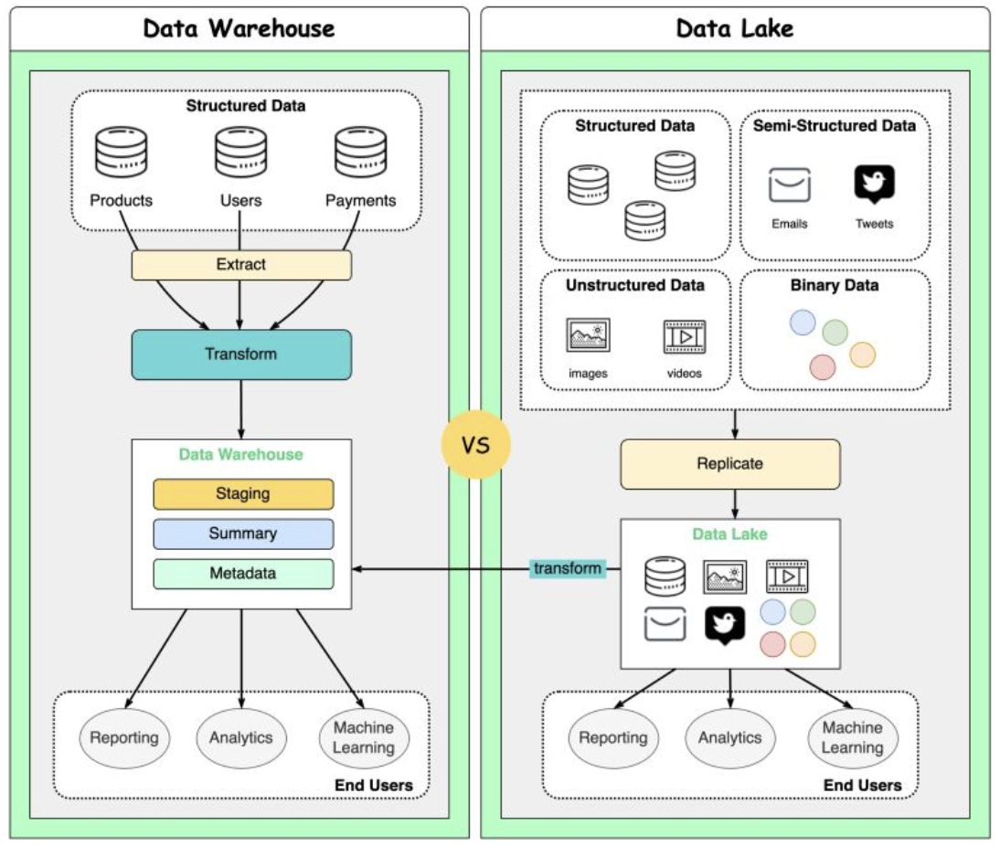

Hey data pioneers and cloud architects! In our previous discussions, we've touched upon Big Data and the tools to query it. Today, we're zooming into two critical concepts in that landscape: **Data Lakes** and **Databricks**. As organizations collect ever-increasing volumes of diverse data, understanding how to store, manage, and process this data effectively is key to unlocking its value.

Data lakes offer a flexible way to store massive amounts of raw data, but they come with their own challenges. Databricks, with its innovative "Lakehouse" architecture, aims to provide a unified platform that combines the benefits of data lakes with the reliability and performance of data warehouses. Let's explore!

## Understanding Data Lakes: The Unstructured Data Ocean

Imagine a vast natural lake where water from various sources like rivers and rain collects in its original, unfiltered form. A **Data Lake** is conceptually similar for data.

### What is a Data Lake?

A Data Lake is a centralized repository that allows you to store vast amounts of structured, semi-structured, and unstructured data in its raw, native format, without any predefined schema. It follows a "store now, analyze later" philosophy. Unlike traditional data warehouses that require data to be structured and transformed before loading (schema-on-write), data lakes often employ a schema-on-read approach, where the structure is applied when the data is read for analysis.

Common storage backends for data lakes include cloud object storage services like Amazon S3, Azure Data Lake Storage (ADLS), and Google Cloud Storage (GCS), known for their scalability and cost-effectiveness. Data lakes are integral to modern data pipelines, often serving as the initial ingestion point for raw data.

### Why Data Lakes? The Benefits

* **Scalability:** Designed to store and handle petabytes or even exabytes of data cost-effectively.
* **Flexibility:** Accommodates all types of data from diverse sources—logs, social media feeds, sensor data, images, videos, relational data, etc.
* **Data Accessibility & Agility:** Centralizes data, making it accessible for various analytics and machine learning use cases without needing to fit it into a rigid schema first. This supports faster exploration and experimentation.
* **Cost-Effectiveness:** Utilizes relatively inexpensive object storage, making it cheaper to store large volumes of raw data compared to traditional data warehouses.

### The Challenges: Avoiding the "Data Swamp"

While powerful, data lakes can turn into "data swamps" if not managed properly. Common challenges include:

* **Data Governance and Quality:** Without proper metadata management, schema enforcement (at some point), and quality checks, data can become unreliable and difficult to use.
* **Discoverability:** Finding and understanding the right data can be hard in a vast, schema-less environment.
* **Security:** Ensuring appropriate access controls and data protection across diverse datasets.
* **Performance:** Querying raw, unoptimized data can be slow without the right tools and techniques.

### Data Lake vs. Data Warehouse: A Quick Comparison

| Feature                 | Data Lake                                                    | Data Warehouse                                             |
| :---------------------- | :----------------------------------------------------------- | :--------------------------------------------------------- |
| **Data Type**     | Raw, diverse (structured, semi-structured, unstructured)     | Processed, structured                                      |
| **Schema**        | Schema-on-read (flexible)                                    | Schema-on-write (predefined, rigid)                        |
| **Processing**    | ELT (Extract, Load, Transform)                               | ETL (Extract, Transform, Load)                             |
| **Primary Users** | Data scientists, data engineers, ML engineers                | Business analysts, BI users                                |
| **Use Cases**     | Data exploration, ML, advanced analytics, raw data archiving | Business intelligence, reporting, structured data analysis |
| **Cost**          | Generally lower (uses object storage)                        | Generally higher (specialized database systems)            |

## Introducing Databricks: Bringing Order to the Data Lake with the Lakehouse

Databricks is a unified data analytics platform founded by the original creators of Apache Spark. It aims to simplify big data analytics and AI by providing a collaborative environment built around the concept of the **Lakehouse Platform**.

### What is the Lakehouse Platform?

The Lakehouse architecture, pioneered by Databricks, combines the key benefits of data lakes (low-cost, flexible storage for raw and diverse data) with the essential features of data warehouses (ACID transactions, data governance, reliability, and performance optimization). Essentially, it strives to offer the best of both worlds, enabling diverse workloads—from data engineering and SQL analytics to data science and machine learning—on a single, unified platform using the same underlying data.

Databricks typically runs on top of your existing cloud data lake (e.g., AWS S3, Azure ADLS, Google Cloud Storage).

### Key Components and Features of Databricks

* **Apache Spark:** At its core, Databricks is powered by an optimized version of Apache Spark, providing fast and scalable distributed data processing for batch and stream workloads.
* **Delta Lake:** This is a critical open-source storage layer that brings reliability and performance to data lakes. Delta Lake adds:
  * **ACID Transactions:** Ensures data integrity and consistency for concurrent reads and writes.
  * **Schema Enforcement & Evolution:** Prevents data corruption from bad data and allows schemas to evolve gracefully over time.
  * **Data Versioning (Time Travel):** Allows users to query previous versions of data, rollback changes, and audit data history.
  * **Upserts and Deletes:** Simplifies change data capture (CDC) and compliance (e.g., GDPR).
  * **Performance Optimizations:** Features like data skipping, Z-Ordering, and compaction improve query speeds.
* **MLflow:** An open-source platform, integrated into Databricks, for managing the end-to-end machine learning lifecycle. This includes tracking experiments, packaging code into reproducible runs, and deploying models.
* **Photon:** A high-performance, C++-based query engine developed by Databricks, fully compatible with Spark APIs. Photon accelerates SQL queries and DataFrame operations, providing significant speedups for various workloads.
* **Unified Analytics Workspace:** A collaborative environment that allows data engineers, data scientists, business analysts, and machine learning engineers to work together using interactive notebooks (supporting Python, SQL, Scala, R), dashboards, and job schedulers.
* **Databricks SQL:** Provides a SQL-native experience with optimized performance for BI and reporting directly on data in the lakehouse. It offers a familiar SQL interface for analysts.
* **Data Governance & Security:** Databricks includes features for managing data access controls (Unity Catalog for centralized governance), auditing, and ensuring compliance.

### How Databricks Addresses Data Lake Challenges

Databricks, particularly with Delta Lake, tackles many of the traditional "data swamp" problems:

* **Reliability & Quality:** Delta Lake's ACID transactions, schema enforcement, and quality checks ensure data is trustworthy.
* **Performance:** The combination of optimized Spark, Photon, and Delta Lake optimizations significantly improves query performance on raw data.
* **Governance:** Unity Catalog provides fine-grained access control, data discovery, and lineage tracking.
* **Unified Approach:** Enables ETL, BI, streaming, data science, and machine learning workloads on the same data copy, reducing data silos and complexity.

### Use Cases for Databricks

Databricks is versatile and supports a wide range of applications:

* **Large-Scale Data Engineering & ETL:** Building robust and scalable data pipelines.
* **Business Intelligence & SQL Analytics:** Powering interactive dashboards and ad-hoc queries for analysts.
* **Real-time Streaming Analytics:** Processing and analyzing streaming data from sources like Kafka.
* **Machine Learning & AI:** Developing, training, and deploying machine learning models at scale.
* **Industry-Specific Solutions:** Genomics processing, financial risk modeling, customer churn prediction, IoT analytics, and more.

Azure Databricks is a prominent example of how Databricks is integrated as a first-party service on cloud platforms.

## Key Takeaways

* **Data Lakes** provide a scalable and flexible way to store massive amounts of raw, diverse data, forming the foundation for big data analytics.
* However, data lakes can become "data swamps" without proper management, leading to issues with data quality, governance, and performance.
* **Databricks**, with its **Lakehouse architecture**, aims to combine the openness and flexibility of data lakes with the reliability and performance of data warehouses.
* Key Databricks components like **Apache Spark**, **Delta Lake**, and **MLflow** provide a unified platform for data engineering, SQL analytics, data science, and machine learning.
* Delta Lake, in particular, brings crucial features like ACID transactions, schema enforcement, and time travel to data lakes, enhancing data reliability.

By bringing structure, reliability, and performance to data lakes, Databricks empowers organizations to unlock the full potential of their data for a wide spectrum of analytical and AI-driven initiatives.
