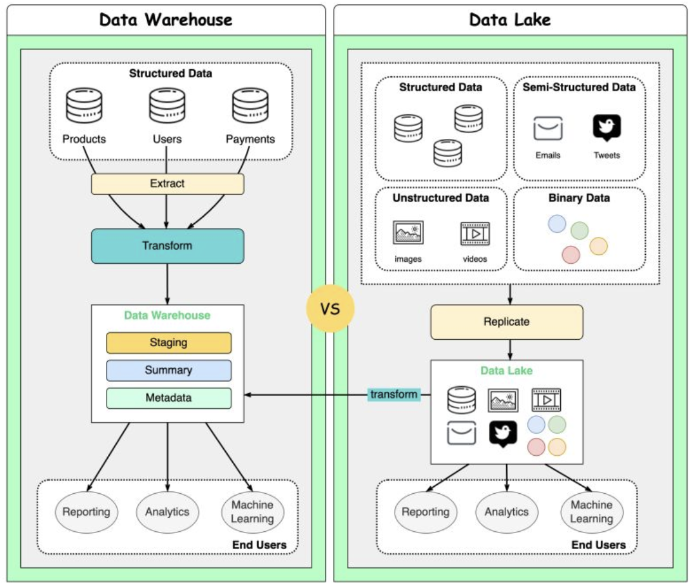

A data warehouse makes you decide the schema before you load anything. That's great for reliability and terrible for the data you haven't figured out what to do with yet — logs, sensor feeds, clickstreams, the raw material for machine learning. The **data lake** was the reaction: dump everything into cheap object storage in its native format, and impose structure only when you read it.

The flexibility is real, and so is the failure mode. Without governance, a lake becomes a *swamp* — petabytes nobody can trust or query. **Databricks** and its **Lakehouse** architecture are an attempt to keep the lake's cheap flexible storage while adding back the guarantees that made warehouses reliable.

## What a data lake is

A data lake is a central repository that holds structured, semi-structured, and unstructured data in raw form, with no schema required up front. The philosophy is "store now, analyse later": it's **schema-on-read**, where structure is applied at query time, versus a warehouse's **schema-on-write**, where data must conform before it's loaded.

The storage underneath is almost always cloud object storage — Amazon S3, Azure Data Lake Storage, Google Cloud Storage — chosen for scale and price.

| | Data lake | Data warehouse |
| --- | --- | --- |
| Data | Raw, any structure | Processed, structured |
| Schema | On read (flexible) | On write (rigid) |
| Pipeline | ELT — load then transform | ETL — transform then load |
| Users | Data scientists, ML engineers | Business analysts, BI |
| Cost | Lower (object storage) | Higher (specialised systems) |

### Why lakes turn into swamps

- **No governance or quality control.** Nothing enforces a schema or checks the data, so it drifts into being unreliable.
- **Poor discoverability.** Finding and understanding the right dataset in a schema-less sea is hard.
- **Security sprawl.** Consistent access control across wildly varied data is hard to maintain.
- **Slow queries.** Raw, unindexed, uncompacted files are expensive to scan.

## Databricks and the Lakehouse

Databricks was founded by the creators of [Apache Spark](/citadel/tech/apache), and its platform sits on top of your existing lake (S3, ADLS, or GCS). The **Lakehouse** idea is to run data engineering, SQL analytics, data science, and ML against one copy of the data, with warehouse-grade reliability on lake-grade storage.

The pieces:

- **Spark** — an optimised build of the engine, for distributed batch and stream processing.
- **Delta Lake** — the key component. It's an open-source storage layer over the lake's files that adds:
  - **ACID transactions**, so concurrent reads and writes don't corrupt a table.
  - **Schema enforcement and evolution** — bad data is rejected at write time; intended schema changes are applied cleanly.
  - **Time travel** — every write is a version, so you can query the table as of last Tuesday, roll back a bad load, or audit history.
  - **Upserts and deletes** — `MERGE` support, which makes change-data-capture and GDPR-style deletion practical on a lake.
  - **Performance features** — data skipping, Z-ordering, and compaction to make queries on raw files fast.
- **MLflow** — tracks experiments, packages runs reproducibly, and manages model deployment.
- **Photon** — a C++ query engine, Spark-API-compatible, that accelerates SQL and DataFrame work.
- **Unity Catalog** — centralised governance: fine-grained access control, data discovery, and lineage.
- **Workspace and Databricks SQL** — collaborative notebooks (Python, SQL, Scala, R) and a SQL-native interface for BI.

Delta Lake is what drains the swamp: transactions and schema enforcement restore reliability, the performance features restore query speed, and Unity Catalog restores governance — all without moving the data off object storage or into a separate warehouse.

## Where it's used

Large-scale ETL, BI and SQL analytics, real-time streaming analytics fed from [Kafka](/citadel/tech/kafka), and machine learning at scale — plus domain-specific work like genomics, financial risk modelling, and churn prediction. Azure Databricks is the same platform offered as a first-party cloud service. The federated-query alternative, querying the lake in place without a platform layer, is [Starburst and Trino](/citadel/tech/starbust); the broader design space is [data pipelining](/citadel/interview/data-pipelining) and [data systems](/citadel/interview/data-systems).

## The takeaway

The data lake traded the warehouse's reliability for cheap, flexible storage, and often lost the data's usefulness in the process. The Lakehouse is the claim that you don't have to choose: Delta Lake puts ACID transactions, schema enforcement, and versioning back on top of plain object storage, so one system covers both raw exploration and trustworthy reporting.
