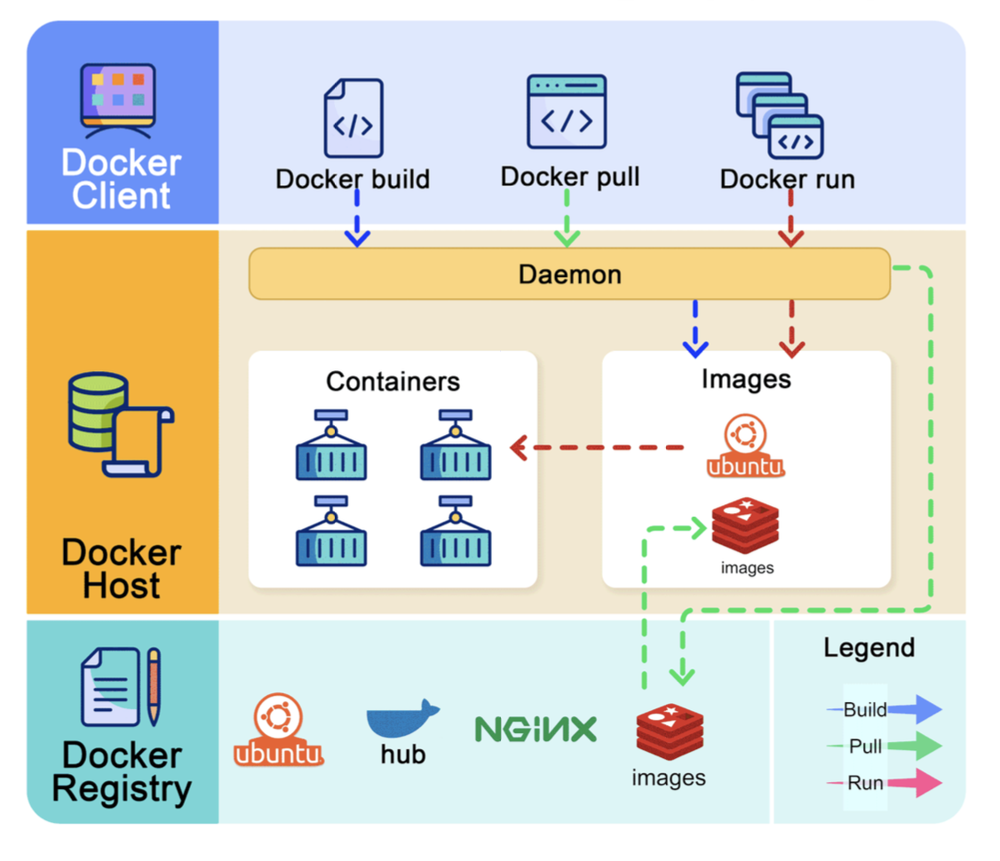

Hey everyone! If you're in the software world, you've likely heard the infamous phrase: "But it works on my machine!" It's a classic developer lament, often stemming from differences in environments between development, testing, and production. Well, what if I told you there's a powerful tool designed to make this problem a relic of the past? Enter **Docker**!

Docker has revolutionized how we build, ship, and run applications by introducing the concept of **containerization**. It’s an open-source platform that allows you to package, distribute, and run applications in isolated, lightweight environments called containers. Whether you're a seasoned developer or just starting, understanding Docker is becoming increasingly essential. Let's unpack what makes it so transformative.

## What is Docker, Really?

At its heart, Docker provides a way to bundle your application and all its dependencies—code, runtime, system tools, system libraries, and settings—into a portable container. This self-contained package can then run consistently across different computing environments, from a developer's laptop to a production server in the cloud.

## How Does Docker Work? The Core Architecture

Docker's architecture is surprisingly straightforward, consisting of three main components:

1. **Docker Client:** This is your command center. It's the interface (often a command-line tool) through which you interact with Docker. You'll use commands like `docker build`, `docker pull`, and `docker run` which are sent to the Docker daemon.
2. **Docker Host:** This is where the magic happens. The Docker Host runs the **Docker daemon** (dockerd), a persistent background process that listens for Docker API requests from the client and manages Docker objects. These objects include:
   * **Images:** Blueprints for your containers.
   * **Containers:** Running instances of those images.
   * **Networks:** How containers communicate.
   * **Volumes:** How containers persist data.
3. **Docker Registry:** This is a storage system for Docker images. **Docker Hub** is a widely-used public registry where you can find thousands of pre-built images or store your own. You can also set up private registries for your organization's images.

## Key Docker Concepts: The Building Blocks

Let's get familiar with some fundamental Docker terms:

* **Dockerfile:** This is a text document that contains all the commands, in order, needed to build a given Docker image. It specifies the base image (e.g., an operating system like Ubuntu or a runtime like Node.js), lists dependencies to install, and defines the command to run when the container starts.
* **Docker Image:** An image is a lightweight, standalone, executable package that includes everything needed to run a piece of software: the code, a runtime, libraries, environment variables, and config files. Images are built from Dockerfiles and can be versioned.
* **Docker Container:** A container is a runnable instance of a Docker image. You can create, start, stop, move, or delete a container using the Docker API or CLI. Containers are isolated from one another and from the host machine, providing a secure and reproducible environment.
* **Docker Volumes:** Volumes are the preferred mechanism for persisting data generated by and used by Docker containers. They are managed by Docker, exist outside the container’s writable layer, and can be shared among multiple containers.
* **Docker Compose:** A tool for defining and running multi-container Docker applications. With Compose, you use a YAML file to configure your application's services, networks, and volumes, and then, with a single command, create and start all the services from your configuration.
* **Docker Networks:** Docker provides networking capabilities to enable containers to communicate with each other and with the host machine (and the outside world). You can create custom networks to isolate containers or allow selective communication.

### Example: The `docker run` Command Lifecycle

When you execute `docker run <image_name>`:

1. Docker first checks if the image is available locally on the Docker Host. If not, it **pulls the image** from the configured Docker Registry (e.g., Docker Hub).
2. Docker **creates a new container** based on this image.
3. It **allocates a read-write filesystem** to the container, as its own isolated space.
4. Docker **creates a network interface** to connect the container to a default or specified network.
5. Finally, Docker **starts the container**, executing the command specified in the Dockerfile.

## Docker Containers vs. Virtual Machines (VMs)

A common point of confusion is how Docker containers differ from VMs.

* **Virtual Machines (VMs):** VMs virtualize an entire hardware stack, including the operating system. Each VM has its own OS, kernel, and libraries, making them quite resource-heavy.
* **Docker Containers:** Containers, on the other hand, virtualize the operating system. They share the host system's OS kernel. This makes them much more lightweight, faster to start, and more efficient in terms of resource usage compared to VMs. Docker uses features like Linux namespaces (for isolation of resources like process IDs, network, etc.) and cgroups (for limiting resource usage) to achieve this isolation.

Think of VMs as separate houses, each with its own infrastructure, while containers are more like apartments in a building, sharing common infrastructure (the host OS kernel) but with their own isolated living spaces.

### Docker on Windows?

Yes! While Docker technology is rooted in Linux kernel features, it also works on Windows. Docker Desktop for Windows uses a lightweight Linux-based VM in the background (using WSL 2 - Windows Subsystem for Linux) to run Linux containers. Windows containers (which run Windows-based applications) are also supported.

## Docker and Kubernetes: Better Together?

While Docker provides the containerization technology, managing a large number of containers across multiple machines, handling scaling, load balancing, and self-healing can become complex. This is where container orchestration platforms like **Kubernetes (K8s)** come in.

* **Docker** operates at the individual container level, typically on a single host. You would manually manage each host and configure networking, security, and storage for multiple related containers, which can be complex.
* **Kubernetes** operates at the cluster level. It automates the deployment, scaling, and management of containerized applications across a cluster of nodes (which can be physical or virtual machines).

In essence, Docker creates the containers, and Kubernetes orchestrates them at scale. Many Kubernetes deployments use Docker as the underlying container runtime.

## Is Docker Still Relevant?

Absolutely! Despite the rise of orchestrators like Kubernetes, Docker remains fundamental. It provides the standardized unit of deployment (the container) that these orchestrators manage. For individual developers, local development, CI/CD pipelines, and smaller applications, Docker itself is often sufficient and incredibly useful.

## Key Takeaways

* Docker solves the "it works on my machine" problem by packaging applications and dependencies into portable containers.
* Its architecture involves a client, a host (with the Docker daemon), and registries.
* Images are blueprints, and containers are their running instances.
* Containers are more lightweight and efficient than VMs because they share the host OS kernel.
* Docker is a foundational technology often used in conjunction with orchestrators like Kubernetes for large-scale deployments.

Docker has truly simplified the process of developing, testing, and deploying applications, making it a vital skill for modern software professionals.
