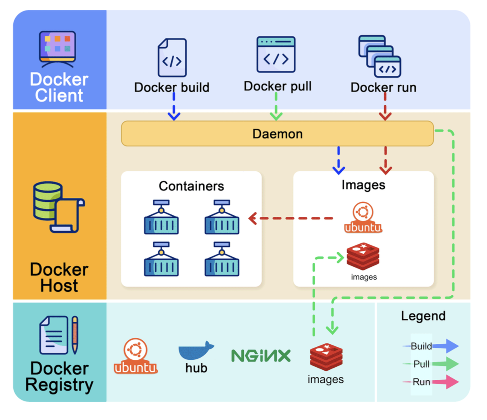

"It works on my machine" is a real bug, not a joke. It happens because an app depends on more than its own code — a language runtime at a specific version, system libraries, environment variables, a config file in the right place — and those differ between your laptop, the CI runner, and the production box.

Docker's fix is to package all of that together. A **container** bundles the application with its runtime, libraries, and settings into one unit that runs the same wherever there's a Docker engine. This post covers how Docker is put together, the handful of concepts you need to use it, and the comparison that comes up in every interview: container versus virtual machine.

## The three pieces

Docker has three components:

1. **Docker client** — the CLI you type into. `docker build`, `docker pull`, `docker run` are requests sent to the daemon; the client itself does no container work.
2. **Docker host** — the machine running the **Docker daemon** (`dockerd`), a background process that listens for those requests and manages the objects: images, containers, networks, and volumes.
3. **Docker registry** — storage for images. **Docker Hub** is the default public one; organisations run private registries for their own images.

## The concepts you actually need

- **Dockerfile** — a text file of ordered build steps: which base image to start from (an OS like `ubuntu`, or a runtime like `node:20`), what dependencies to install, what command to run when a container starts.
- **Image** — the built artifact: a standalone, read-only package with the code, runtime, libraries, and config. Images are versioned and built from Dockerfiles.
- **Container** — a running instance of an image. You can start, stop, move, and delete containers; each is isolated from the others and from the host.
- **Volume** — the supported way to persist data. A volume lives outside the container's writable layer, is managed by Docker, and can be shared between containers, so data survives the container being deleted.
- **Docker Compose** — a YAML file describing a multi-container app (its services, networks, volumes) that you bring up with one command.
- **Networks** — Docker's virtual networks let containers talk to each other, to the host, and out to the internet; custom networks control which containers can reach which.

### What `docker run <image>` does

1. Check whether the image is on the host already. If not, **pull it** from the registry.
2. **Create a container** from the image.
3. **Allocate a read-write filesystem layer** for it, on top of the image's read-only layers.
4. **Attach a network interface** connecting it to the default or a specified network.
5. **Start it**, running the command baked into the image.

## Containers vs virtual machines

Both isolate workloads; they draw the line at different levels.

A **virtual machine** virtualises hardware. Each VM runs its own full operating system — its own kernel, its own libraries — on top of a hypervisor. That's strong isolation, but every VM carries a whole OS, so it's gigabytes in size and takes tens of seconds to boot.

A **container** virtualises the operating system. All containers on a host share that host's kernel. Docker carves out isolation using two Linux kernel features: **namespaces**, which give a container its own view of process IDs, network interfaces, mounts, and hostnames, and **cgroups**, which cap how much CPU and memory it can use. Nothing duplicates the kernel, so a container image is often tens of megabytes and starts in well under a second.

The usual analogy: VMs are separate houses, each with its own plumbing and foundation; containers are apartments in one building, with their own locked doors but shared infrastructure. The trade is isolation strength for weight — a container escape is a kernel-level concern in a way a VM escape isn't.

### Docker on Windows and macOS

Docker's isolation is built on Linux kernel features, so on Windows and macOS, Docker Desktop runs a lightweight Linux VM in the background (via WSL 2 on Windows) and runs your Linux containers inside it. Windows also supports native Windows containers for Windows applications.

## Where Kubernetes comes in

Docker manages containers on a single host. Once you have hundreds of containers across many machines, and you want automatic restarts, scaling, load balancing, and rollouts, you need an [orchestrator](/citadel/interview/orchestration). [Kubernetes](/citadel/tech/k8s) works at the cluster level: you declare the desired state, and it schedules containers onto nodes and keeps them running. Docker builds the standardised unit; Kubernetes moves those units around at scale.

Docker stays relevant even where Kubernetes runs the show, because the container is still the thing being orchestrated. For local development, [CI/CD pipelines](/citadel/interview/ci-cd), and small deployments, Docker on its own is often all you need — and the container image is what makes a [deployment strategy](/citadel/interview/deployments) like blue-green or canary practical, since every environment gets a byte-identical artifact.

## The takeaway

A container is an app plus its dependencies, frozen into an image and run with an isolated view of a shared kernel. That last part — shared kernel — is the whole reason containers start fast and pack densely where VMs are heavy, and it's also the reason their isolation boundary is thinner. Reach for a VM when you need a hard security boundary or a different kernel; reach for a container for everything else.
