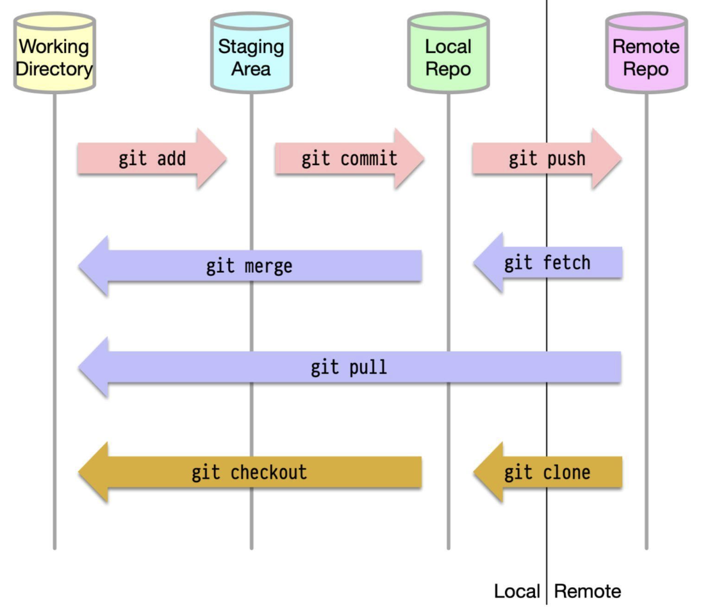
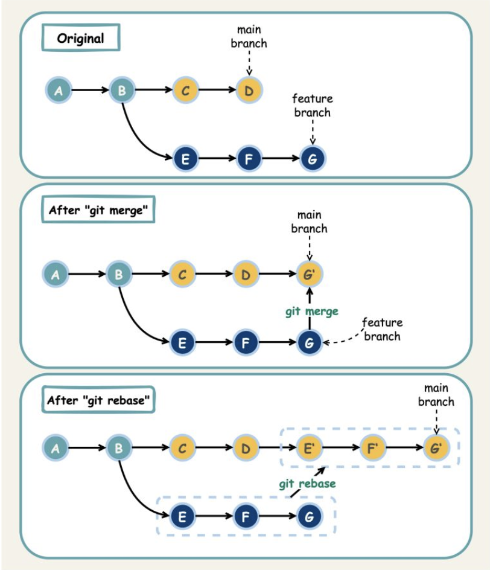

Hey, fellow developers and tech enthusiasts! Ever found yourself in a coding maze, wishing you could rewind time after a disastrous change? Or perhaps you've struggled to collaborate with your team on a complex project without stepping on each other's toes? If so, then you're in the right place! Today, we're demystifying **Git**, the cornerstone of modern software development and version control.

Almost every software engineer has used Git, but truly understanding its mechanics can elevate your development game significantly. It's more than just a tool; it's a philosophy for managing change and fostering collaboration. Let's pull back the curtain and explore how Git works its magic!

## What is Git, Anyway?

At its heart, Git is a **distributed version control system (DVCS)**. This means that instead of one central repository that everyone works on directly, every developer maintains their own local copy (or "clone") of the main repository. They can edit and commit changes to their local copy, making operations like committing incredibly fast because they don't immediately interact with a remote server. A huge advantage of this distributed nature is that if the remote repository crashes, the project can often be recovered from any of the local repositories.

## The Four Arenas: Where Your Code Lives in Git

To really get Git, you need to understand the four primary locations your code transitions through. It's not just your local machine and a remote server!

1. **Working Directory:** This is your active workspace. It's the actual set of files and folders on your computer that you're currently editing.
2. **Staging Area (or Index):** Think of this as a draft board. It's a temporary holding area where you prepare and group the changes from your working directory that you want to include in your next commit.
3. **Local Repository:** This is your personal copy of the project's history. When you "commit," you're saving a snapshot of your staged changes to this local repository. It resides on your machine in a hidden `.git` directory.
4. **Remote Repository:** This is a shared repository, usually hosted on a server (like GitHub, GitLab, or Bitbucket), where team members can push their committed changes and pull updates from others.

### Common Git Commands: Moving Code Between Arenas

Most Git commands are about moving code and changes between these four locations:

* `git add <file>`: Moves changes from your Working Directory to the Staging Area.
* `git commit -m "Your message"`: Takes the changes from the Staging Area and saves them as a new snapshot (commit) in your Local Repository.
* `git push`: Sends your committed changes from your Local Repository to the Remote Repository.
* `git fetch`: Retrieves the latest changes from the Remote Repository but *doesn't* automatically merge them into your Working Directory or Local Repository. It updates your local understanding of the remote branches.
* `git pull`: Combines `git fetch` and `git merge`. It retrieves the latest changes from the Remote Repository and immediately tries to merge them into your current branch in your Working Directory and Local Repository.
* `git clone <url>`: Creates a copy of a Remote Repository onto your local machine, setting up your Working Directory, Local Repository, and the link to the Remote Repository.
* `git checkout <branch>` or `git switch <branch>`: Switches your Working Directory to reflect a different branch from your Local Repository.
* `git merge <branch>`: Combines the history of a specified branch into your current branch.

## Combining Histories: Merge vs. Rebase

When you've developed a feature on a separate branch and want to integrate it back into your main development line (e.g., `main` or `develop`), Git offers two primary strategies: `merge` and `rebase`.

### Git Merge

* **How it works:** `git merge` creates a new, special commit in the target branch (let's say `main`) that ties together the histories of both the `main` branch and your feature branch. This is often called a "merge commit."
* **Characteristics:**
  * It's non-destructive; neither the `main` nor the feature branch histories are changed. The existing branches remain as they are, and the merge commit simply unites them.
  * It preserves the exact history of your feature branch, making it clear when and how features were merged.
  * The project history can look a bit like a graph with many intersecting lines, which some find complex.

### Git Rebase

* **How it works:** `git rebase` essentially rewrites your feature branch's history by moving it to the tip of the target branch (e.g., `main`). It takes each commit from your feature branch and reapplies it, one by one, on top of the `main` branch, creating new commits in the process.
* **Characteristics:**
  * It results in a cleaner, linear project history, as if all the work was done sequentially.
  * It avoids unnecessary merge commits.
  * **Crucial Caveat:** Rebasing rewrites history. This can be dangerous if not handled correctly, especially with shared branches.

### The Golden Rule of Git Rebase

This is paramount: **Never use `git rebase` on public branches** (branches that other developers are pulling from and working on). Doing so can create inconsistencies and major headaches for your collaborators because their local history will diverge from the rebased history. Stick to rebasing your own local feature branches before merging them.

## Navigating with Branches: Git Flow

Teams often adopt specific branching strategies to manage their development process. One popular and comprehensive strategy is **Git Flow**. While there are variations, the core idea involves several types of branches:

* **`main` (or `master`):** This branch is for production-ready code only. Every commit here should be a stable release.
* **`develop`:** This is the primary branch for ongoing development. All feature work is integrated here.
* **Feature Branches:** These are created from the `develop` branch for working on new features. Once a feature is complete, it's merged back into `develop`.
* **Release Branches:** When `develop` has enough features for a release, a release branch is created from `develop`. This branch is used for final bug fixes, documentation generation, and other release-oriented tasks. No new features are added here. Once ready, it's merged into `main` (and tagged with a version number) and also back into `develop` (to incorporate any bug fixes).
* **Hotfix Branches:** These are created directly from the `main` branch to quickly address critical bugs in production. Once fixed, the hotfix is merged back into both `main` and `develop` (or the current release branch).

Git Flow provides a robust framework for managing larger projects with scheduled releases, though simpler models like GitHub Flow or Trunk-Based Development are also popular, especially for projects with more frequent deployments.

## Key Takeaways

* Git is a powerful distributed version control system that helps manage code changes and collaboration.
* Understanding the four code locations (Working Directory, Staging Area, Local Repo, Remote Repo) is key to grasping how Git commands operate.
* `git merge` and `git rebase` are two ways to integrate changes, each with its own impact on project history.
* Branching strategies like Git Flow provide structured workflows for development teams.

Mastering Git is a journey, but even a solid understanding of these fundamentals can significantly improve your efficiency and collaboration as a developer.
