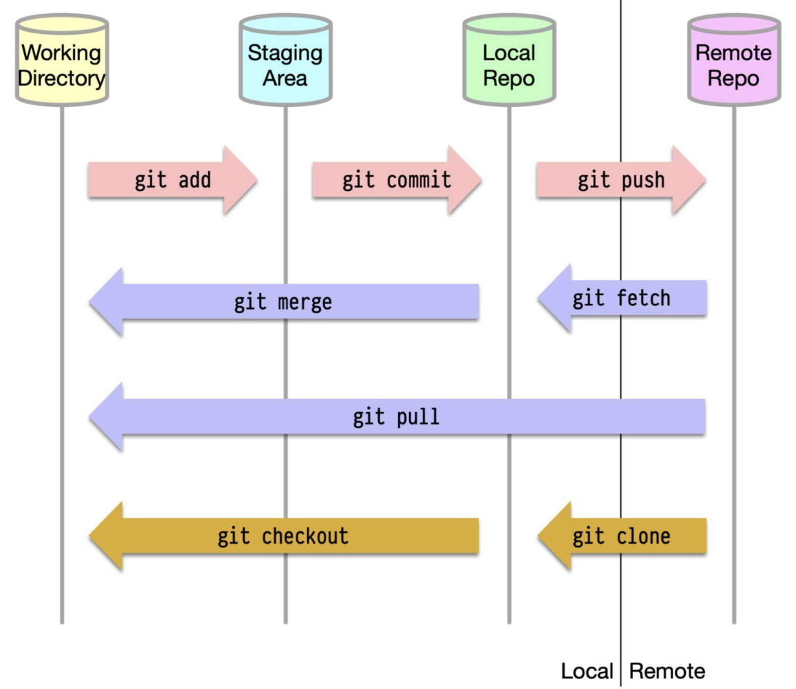
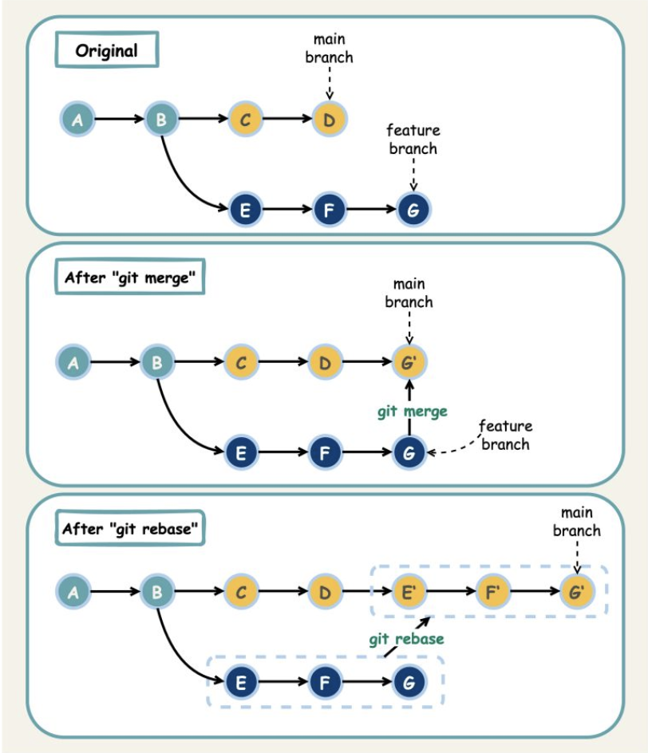

Almost every developer uses Git, and most of us learned it as a set of spells: `add`, `commit`, `push`, and a nervous `git pull` when something looks stale. The spells work until they don't — a rebase touches commits you didn't expect, a merge leaves a tangle, a colleague's history diverges from yours overnight.

Underneath, Git is simpler than its command surface suggests. Your code lives in exactly four places, and nearly every command is a move between two of them. Get that picture straight and the rest stops being memorisation. This post lays out the four-tree model, then the one decision that actually has a wrong answer: merge or rebase.

## Distributed by design

Git is a **distributed version control system**: instead of one central server everyone edits against, every developer holds a full clone of the repository — all of its history, not just the latest snapshot. Commits are local operations, which is why they're instant; nothing talks to a server until you `push`. It also means the project survives the server dying. If the central host is lost, any complete clone can become the new origin.

## The four trees

To read any Git command, know which two of these it connects:

1. **Working directory** — the actual files on disk that you're editing right now.
2. **Staging area** (the *index*) — a draft of your next commit. You add changes here to say "this much goes in, the rest waits."
3. **Local repository** — your machine's copy of the project history, in the hidden `.git` directory. A commit writes a snapshot here.
4. **Remote repository** — the shared copy on a host like GitHub or GitLab, where the team's work converges.

The common commands are all transfers along that chain:

| Command | Moves |
| --- | --- |
| `git add <file>` | working directory → staging area |
| `git commit -m "..."` | staging area → local repository (a new snapshot) |
| `git push` | local repository → remote repository |
| `git fetch` | remote → your local view of remote branches (working files untouched) |
| `git pull` | `fetch` then `merge` into the current branch |
| `git clone <url>` | remote → a fresh local repo, working directory, and origin link |
| `git checkout` / `git switch <branch>` | local repository → working directory (swap to another branch) |
| `git merge <branch>` | folds another branch's history into the current one |

The `fetch`/`pull` distinction is where surprises come from: `fetch` only updates what your repo *knows* about the remote; `pull` also changes your working files by merging. When a `pull` does something unexpected, it's the merge half, not the fetch half.

## Merge vs rebase

You've built a feature on its own branch and want it back in `main`. Git offers two ways to combine the histories, and they produce genuinely different results.

### Merge

`git merge` creates one new **merge commit** on `main` with two parents — the tip of `main` and the tip of your feature branch — tying the histories together. Neither branch's existing commits change.

- Non-destructive: every original commit stays exactly as it was.
- The history records *when* and *how* the feature was integrated, which is sometimes what you want to know later.
- With many branches, the graph grows lots of crossing lines. Some people find that noisy.

### Rebase

`git rebase main` rewrites your feature branch: it takes each of your commits, sets them aside, moves the branch's starting point to the current tip of `main`, and reapplies your commits one by one on top. Each replayed commit is a *new* commit with a new hash, even if the change is identical.

- The result is a straight line, as if you'd done the work after everyone else's.
- No merge commits.
- Because it rewrites history, it's dangerous on a branch other people have.

### The rule that has a wrong answer

**Never rebase a branch that others have pulled from.** Rebasing replaces commits with new ones; anyone who already has the old commits now has a history that diverges from yours, and reconciling it is painful and error-prone. Rebase your own local feature branch to tidy it before sharing — then merge it in. That combination (private rebase, public merge) gives you the clean line without the hazard.

## Git Flow and its lighter cousins

Teams layer a **branching strategy** on top of Git to agree on what each branch means. The classic one is **Git Flow**:

- **`main`** — production-ready only; every commit is a release.
- **`develop`** — the integration branch where all feature work lands.
- **Feature branches** — cut from `develop`, merged back into `develop` when done.
- **Release branches** — cut from `develop` when it has enough for a release; only bug fixes, docs, and release prep happen here. Merged into `main` (and tagged) and back into `develop`.
- **Hotfix branches** — cut from `main` to fix a production bug fast, then merged into both `main` and `develop`.

Git Flow suits projects with scheduled, versioned releases. Teams that deploy many times a day usually find it too heavy and use **GitHub Flow** (branch off `main`, open a pull request, merge, deploy) or **trunk-based development** (short-lived branches, or commit straight to `main` behind feature flags). The [CI/CD pipeline](/citadel/interview/ci-cd) a team runs and its [deployment strategy](/citadel/interview/deployments) usually decide which branching model is worth the overhead; the [monorepo-vs-many-repos choice](/citadel/interview/repo) shapes it too.

## The one thing to keep

Every Git command is a move between the working directory, the staging area, the local repo, and the remote. When a command confuses you, ask which two it connects and in which direction — that alone resolves most of it. And keep rebase on the private side of the line: rewrite your own history freely, never someone else's.
