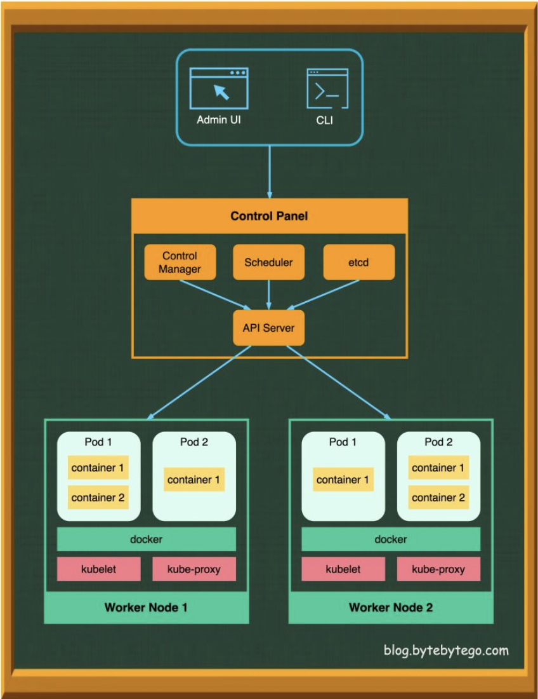
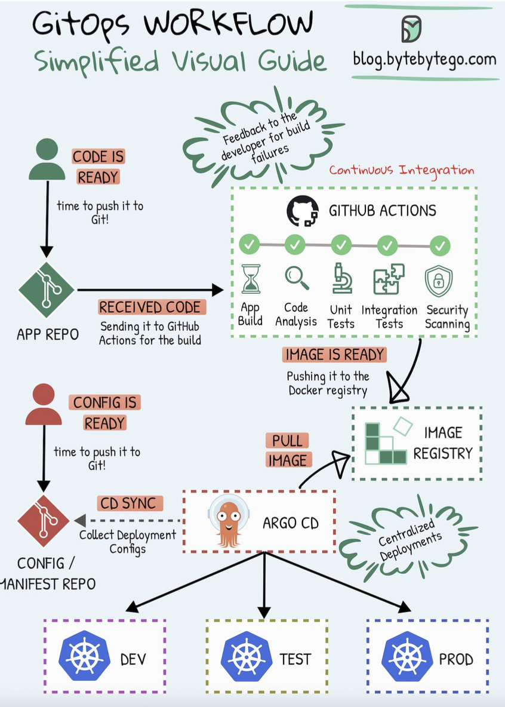

Hey everyone, and welcome back! In the world of modern software development, containers have become the standard for packaging and running applications. But how do you manage thousands of these containers, ensuring they run smoothly, scale appropriately, and are always up-to-date? That's where **Kubernetes (K8s)** steps in. And to make managing deployments on Kubernetes even more streamlined and reliable, we have tools like **Argo CD** that embrace the **GitOps** philosophy.

Today, we'll explore the powerhouse duo of Kubernetes and Argo CD, understanding how they work together, and we'll also delve into some common **Kubernetes Design Patterns** that help build robust and scalable cloud-native applications. These patterns are crucial for leveraging the full power of K8s, whether you're deploying applications here in Bengaluru or for a global audience.

## Understanding Kubernetes (K8s): The Container Conductor

Kubernetes, often abbreviated as K8s (K-eight-s, get it?), is an open-source container orchestration system originally designed by Google and now maintained by the Cloud Native Computing Foundation (CNCF). It automates the deployment, scaling, and management of containerized applications. Think of it as the conductor of an orchestra, ensuring all your containerized applications (the musicians) play in harmony.

### Why Kubernetes?

* **Automation:** Kubernetes automates many manual processes involved in deploying and scaling containerized applications.
* **Scalability:** Easily scale your applications up or down based on demand.
* **Self-healing:** Kubernetes can automatically restart failed containers, replace and reschedule containers when nodes die, and kill containers that don't respond to health checks.
* **Service Discovery & Load Balancing:** K8s can expose a container using a DNS name or its own IP address and load-balance traffic to it.
* **Fault Tolerance & High Availability:** By distributing applications across a cluster of machines, K8s provides resilience against hardware failures.
* **Efficient Resource Utilization:** Optimizes the use of underlying hardware resources.

### Core Kubernetes Components: Control Plane & Nodes

A Kubernetes cluster consists of a set of worker machines, called **nodes**, that run containerized applications. Every cluster has at least one worker node and a **control plane** that manages these nodes and the Pods within the cluster.

#### The Control Plane: The Brains of the Operation
The control plane's components make global decisions about the cluster (e.g., scheduling) and detect and respond to cluster events.
* **API Server (`kube-apiserver`):** The frontend of the Kubernetes control plane. It exposes the Kubernetes API, which is how all other components (and users) interact with the cluster.
* **etcd:** A consistent and highly-available key-value store used as Kubernetes' backing store for all cluster data.
* **Scheduler (`kube-scheduler`):** Watches for newly created Pods that have no node assigned, and for every Pod that the scheduler discovers, it finds the best node for that Pod to run on.
* **Controller Manager (`kube-controller-manager`):** Runs controller processes (e.g., Node controller, Job controller, Deployment controller, ReplicaSet controller). These controllers watch the state of the cluster through the API Server and make changes to drive the actual state towards the desired state.

#### Node Components: Where the Work Gets Done
Node components run on every node, maintaining running pods and providing the Kubernetes runtime environment.
* **Kubelet:** An agent that runs on each node in the cluster. It communicates with the API Server and ensures that containers are running in a Pod as specified by the control plane.
* **Kube-proxy:** A network proxy that runs on each node in your cluster, implementing part of the Kubernetes Service concept. It maintains network rules on nodes and allows network communication to your Pods from network sessions inside or outside of your cluster.
* **Container Runtime:** The software responsible for running containers (e.g., Docker, containerd, CRI-O).
* **Pods:** The smallest and simplest deployable units of computing that can be created and managed in Kubernetes. A Pod represents a running process on your cluster and encapsulates an application's container (or, in some cases, multiple tightly coupled containers), storage resources (volumes), a unique network IP, and options that govern how the container(s) should run.

### Exposing Your Applications: Kubernetes Service Types
Kubernetes provides several ways to expose your applications running in Pods, making them accessible:
* **ClusterIP:** Exposes the Service on a cluster-internal IP. This makes the Service only reachable from within the cluster (default type).
* **NodePort:** Exposes the Service on each Node’s IP at a static port. You can contact the NodePort Service, from outside the cluster, by requesting `<NodeIP>:<NodePort>`.
* **LoadBalancer:** Exposes the Service externally using a cloud provider's load balancer. This is the standard way to expose services to the internet on cloud platforms.
* **ExternalName:** Maps a Service to a DNS name, often used to represent external services within Kubernetes, providing a level of indirection.

### Leveraging Kubernetes Design Patterns: Building Robust Cloud-Native Applications
Beyond its core components, the power of Kubernetes is truly unlocked by understanding and applying common **design patterns**. These patterns provide reusable solutions to common problems encountered when designing, building, and managing applications on Kubernetes. While Kubernetes itself utilizes various foundational, structural, behavioral, and higher-level patterns in its own architecture, developers building applications *on* Kubernetes also leverage specific patterns.

Here are a few key categories and examples:

#### 1. Foundational Patterns (Managing the Application Lifecycle)
These patterns relate to how applications are run, managed, and observed.
* **Health Probes (Liveness & Readiness):**
    * **Liveness Probe:** Kubelet uses liveness probes to know when to restart a container. If a liveness probe fails (e.g., the application hangs), Kubelet kills the container, and the container is subject to its restart policy.
    * **Readiness Probe:** Kubelet uses readiness probes to know when a container is ready to start accepting traffic. A Pod is considered ready when all of its containers are ready. If a readiness probe fails, the Pod's IP address is removed from the endpoints of all Services.
    * **Startup Probe:** Kubelet uses startup probes to know when an application has started. If configured, it disables liveness and readiness checks until it succeeds, ensuring slow-starting applications are not killed prematurely.
* **Resource Management:** Defining resource requests (guaranteed minimum) and limits (maximum allowable) for CPU and memory for containers. This helps Kubernetes schedule Pods efficiently and prevent resource starvation or overconsumption.
* **Secret & ConfigMap Management:**
    * **Secrets:** For storing and managing sensitive information like passwords, OAuth tokens, and SSH keys. Secrets can be mounted as data volumes or exposed as environment variables to Pods.
    * **ConfigMaps:** For storing non-confidential configuration data in key-value pairs. Like Secrets, they can be consumed by Pods as environment variables, command-line arguments, or as configuration files in a volume.

#### 2. Structural Patterns (Organizing Containers within Pods)
These patterns focus on how containers are composed within Pods to achieve specific functionalities.
* **Sidecar Pattern:** A Pod contains one primary application container and one or more "sidecar" containers. Sidecars augment or enhance the main application container by providing supporting functionalities like logging, monitoring, proxying, or acting as an adapter. They share the same network namespace and can share volumes.
    * *Example:* A logging sidecar that collects logs from the main application container and forwards them to a centralized logging system.
* **Ambassador Pattern:** An ambassador container acts as a proxy that handles network communication for the main application container. It abstracts away complexities of service discovery, retries, or security protocols for the application.
    * *Example:* An ambassador handling mTLS (mutual TLS) for an application container that is not mTLS-aware.
* **Adapter Pattern:** An adapter container standardizes or transforms the output or interface of the main application container to match the expectations of an external system or another standardized interface.
    * *Example:* An adapter container that converts log formats from an application into a standardized format required by a centralized logging system.

#### 3. Behavioral Patterns (Managing Interactions and State)
These patterns address how Pods and services behave and interact, especially in a dynamic environment.
* **Controller/Operator Pattern:**
    * **Controllers:** Kubernetes itself uses controllers (like Deployment controller, ReplicaSet controller) to watch the state of resources and reconcile the actual state towards the desired state.
    * **Operators:** Extend Kubernetes' capabilities by encoding human operational knowledge for managing specific stateful applications. An Operator is a custom controller that uses Custom Resource Definitions (CRDs) to manage applications and their components. They automate tasks like deployment, scaling, backup, and recovery for complex stateful applications (e.g., databases).
* **Leader Election:** In distributed applications running multiple instances for high availability, a leader election pattern is used to designate one instance as the "leader" responsible for certain tasks (e.g., coordinating work, handling writes). Kubernetes provides mechanisms to help implement this.
* **Work Queue:** Using a queue (often external, like RabbitMQ or Kafka, or sometimes an internal K8s job queue) to decouple task submission from task execution. Producer services add tasks to the queue, and consumer services (worker Pods) process these tasks asynchronously. This helps manage load and improve resilience.

#### 4. Higher-Level Application Patterns
These patterns describe common ways to deploy different types of workloads on Kubernetes.
* **Batch Job / CronJob:** For running batch processing tasks that run to completion, or scheduled tasks (CronJobs).
* **Stateful Service (StatefulSet):** For managing stateful applications (like databases) that require persistent storage, stable network identifiers, and ordered, graceful deployment and scaling.
* **Serverless Functions on Kubernetes (e.g., using Knative or OpenFaaS):** Patterns for deploying and managing event-driven, serverless functions on a Kubernetes cluster.

Applying these design patterns helps create applications that are more resilient, scalable, manageable, and better aligned with cloud-native principles.

## Enter GitOps: Managing Kubernetes the Declarative Way

While Kubernetes provides a powerful platform, managing its configurations and application deployments declaratively and reliably can still become complex. This is where **GitOps** comes in.

GitOps is an operational framework that takes DevOps best practices used for application development—such as version control, collaboration, compliance, and CI/CD—and applies them to infrastructure and application configuration management. With GitOps, **Git becomes the single source of truth** for the desired state of your system. This desired state is declared in Git (e.g., as Kubernetes YAML manifests), and an automated process ensures the live environment running in Kubernetes matches this declared state.

## Argo CD: Kubernetes Native GitOps in Action

**Argo CD** is a declarative, GitOps continuous delivery tool specifically designed for Kubernetes. It helps you manage application deployments by ensuring that the state of your applications in your Kubernetes cluster mirrors the configurations defined in a Git repository.

### How Argo CD Works (GitOps Workflow with Argo CD)

The workflow typically looks like this, as illustrated in many GitOps diagrams:

1.  **Define Desired State in Git:** Developers and SREs define the desired state of their Kubernetes applications (Deployments, Services, ConfigMaps, Secrets, etc.) using manifest files (e.g., YAML, Helm charts, Kustomize). These files are stored in a Git repository, often called the "config" or "manifest" repo. This Git repo is the single source of truth.
2.  **Continuous Monitoring:** Argo CD continuously monitors this Git repository for any changes to the manifests. It also monitors the live state of the applications running in the target Kubernetes cluster(s).
3.  **Detect Differences (Drift):** Argo CD compares the desired state from Git with the actual live state in the Kubernetes cluster. If there's a discrepancy (often called "drift"), Argo CD flags the application as "OutOfSync."
4.  **Automatic (or Manual) Synchronization:**
    * When a change is pushed to the Git repository (e.g., a new version of an image tag in a Deployment manifest), Argo CD detects it.
    * It then automatically (or manually, if configured) applies these changes to the Kubernetes cluster to make the live state match the desired state in Git. This is the "sync" operation. Argo CD essentially performs `kubectl apply` (or similar) using the manifests from Git.
5.  **Observability & Feedback:** Argo CD provides a user interface and CLI to visualize the state of deployed applications, the sync status, the history of changes, and differences between live and desired states, offering excellent observability into your deployments.

### Benefits of Using Argo CD with Kubernetes

* **Declarative Configuration:** Your entire application environment is described in Git, making it transparent, version-controlled, and auditable.
* **Automated Deployments:** Argo CD automates the process of deploying applications and rolling out updates based on Git commits.
* **Consistency and Reliability:** Ensures that what's running in your cluster is exactly what's defined in Git, eliminating configuration drift.
* **Auditability:** Git's history provides a clear audit trail of every change made to your application's configuration – who changed what, when, and why.
* **Rollbacks:** Reverting to a previous application state is as simple as reverting a commit in the Git manifest repository and letting Argo CD sync the changes.
* **Developer-Centric Experience:** Developers can use familiar Git workflows (pull requests, merges) to manage application deployments without needing direct `kubectl` access for deployments.
* **Enhanced Security:** By using Git as the single source of truth and automating deployments, you can restrict direct `kubectl apply` access to the cluster for application changes, improving security and providing a clear audit trail.

## Key Takeaways

* Kubernetes (K8s) is the de facto standard for container orchestration, automating the deployment, scaling, and management of containerized applications through its control plane and node components.
* Understanding and leveraging **Kubernetes Design Patterns** (like Health Probes, Sidecars, Operators, and Work Queues) is crucial for building robust, scalable, and manageable cloud-native applications on K8s.
* **GitOps** is a modern paradigm for managing Kubernetes configurations and applications, using Git as the single source of truth.
* **Argo CD** is a leading GitOps tool for Kubernetes, providing automated, declarative continuous delivery that ensures your cluster state matches your Git declarations.
* Combining Kubernetes with GitOps practices (using tools like Argo CD) empowers teams to build and operate cloud-native applications with greater speed, confidence, consistency, and reliability.

The synergy between Kubernetes, its rich set of design patterns, and GitOps tools like Argo CD is transforming how we approach application delivery in the cloud-native era, making it more automated, auditable, and developer-friendly.
