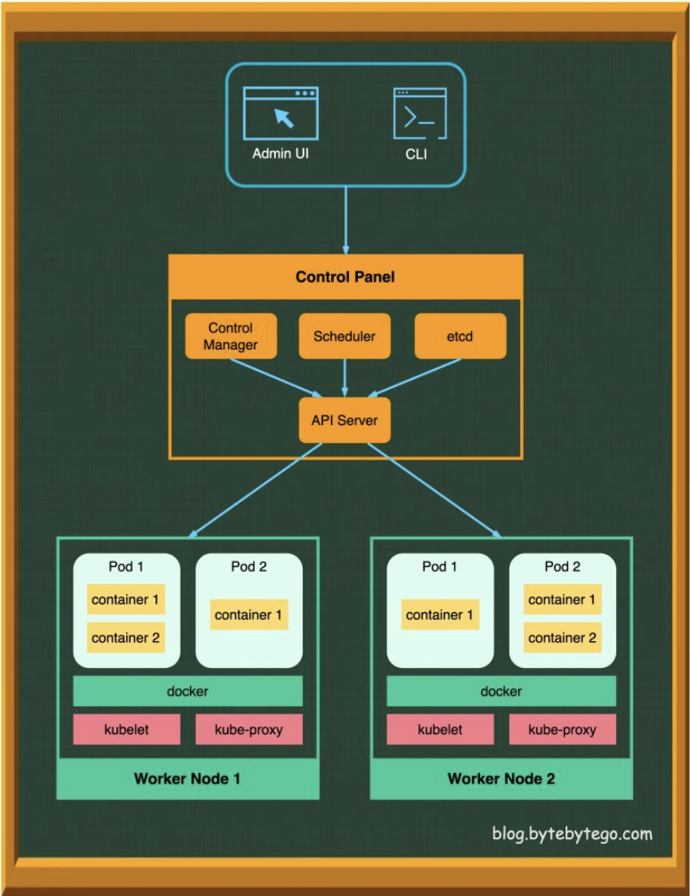
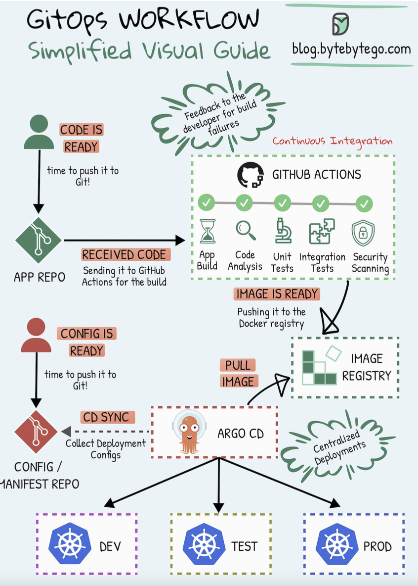

A single [Docker container](/citadel/tech/docker) on one host is easy to run by hand. A few hundred containers across a fleet of machines, each needing to be restarted when it dies, rescheduled when its node fails, scaled up under load, and rolled out without downtime, is not. That gap is what container orchestration fills, and **Kubernetes** (K8s) is the de facto standard for it.

The model is declarative: you describe the state you want — this many replicas of this image, exposed on this port — and Kubernetes continuously works to make the cluster match. This post covers the components that do that work, the patterns for running applications on top of them well, and **Argo CD**, which extends the same declarative idea all the way out to a Git repository.

## What Kubernetes gives you

Kubernetes was built at Google and is now maintained by the Cloud Native Computing Foundation. On top of raw containers it adds:

- **Self-healing** — restarts failed containers, reschedules them when a node dies, and stops routing to containers that fail their health checks.
- **Scaling** — adjusts replica counts up or down, by hand or automatically on a metric.
- **Service discovery and load balancing** — gives a set of containers a stable DNS name and IP, and spreads traffic across them.
- **Higher hardware utilisation** — bin-packs containers onto nodes according to what each one asked for.

## Control plane and nodes

A cluster is a set of **worker nodes** that run your containers, plus a **control plane** that manages them.

The **control plane** makes the global decisions:

- **API server** (`kube-apiserver`) — the front end. Every other component, and every `kubectl` command, goes through it.
- **etcd** — a consistent, highly available key-value store holding all cluster data. It is the source of truth for what the cluster looks like.
- **Scheduler** (`kube-scheduler`) — watches for new Pods with no node assigned and picks the best node for each.
- **Controller manager** (`kube-controller-manager`) — runs the control loops (node controller, deployment controller, ReplicaSet controller, and more). Each one watches the actual state through the API server and nudges it toward the declared state.

Each **node** runs:

- **Kubelet** — the per-node agent that makes sure the containers described by the assigned Pods are actually running.
- **Kube-proxy** — maintains the network rules that implement the Service abstraction, so traffic reaches Pods from inside or outside the cluster.
- **Container runtime** — the software that actually runs containers (containerd, CRI-O, or Docker via a shim).

A **Pod** is the smallest deployable unit: one container, or several tightly coupled ones, sharing a network IP and a set of volumes. You rarely create Pods directly — a Deployment or StatefulSet manages them for you.

### Exposing a workload: Service types

| Type | What it does |
| --- | --- |
| `ClusterIP` | Internal-only IP, reachable from within the cluster. The default. |
| `NodePort` | Opens a static port on every node's IP; reach it at `<NodeIP>:<NodePort>`. |
| `LoadBalancer` | Provisions a cloud provider's load balancer — the standard way to expose a service to the internet. |
| `ExternalName` | Maps the Service name to an external DNS name, as a layer of indirection. |

## Patterns for running apps on Kubernetes

The components above get containers running. These patterns are how you make them run *well* — they come up constantly in real manifests and in design discussions.

**Lifecycle and configuration:**

- **Health probes.** A *liveness* probe tells the kubelet when to restart a hung container. A *readiness* probe tells it when a container is ready for traffic — if it fails, the Pod's IP is pulled from its Service's endpoints but the container keeps running. A *startup* probe suppresses the other two until the app has finished a slow boot, so it isn't killed prematurely.
- **Resource requests and limits.** A *request* is the guaranteed minimum CPU and memory the scheduler reserves; a *limit* is the ceiling the container can't exceed. Requests drive scheduling; limits prevent one Pod starving its neighbours.
- **ConfigMaps and Secrets.** ConfigMaps hold non-sensitive configuration as key-value pairs; Secrets hold passwords, tokens, and keys. Both mount into a Pod as environment variables or files.

**Container composition within a Pod:**

- **Sidecar** — a helper container alongside the main one, sharing its network and volumes, adding logging, metrics, or proxying without changing the app.
- **Ambassador** — a sidecar that proxies the app's *outbound* connections, hiding service discovery, retries, or mTLS from an app that isn't aware of them.
- **Adapter** — a sidecar that reshapes the app's output to a standard format, for example normalising log lines for a central collector.

**Coordination:**

- **Operator** — a custom controller paired with a Custom Resource Definition (CRD) that encodes operational knowledge for a specific stateful system: deploying, scaling, backing up, and recovering a database, say. It extends Kubernetes' reconcile loop to things Kubernetes doesn't natively understand. This is the [controller pattern](/citadel/interview/design-patterns) applied to operations.
- **Leader election** — among several replicas run for availability, elect one leader to own the work that must not happen twice (coordinating writes, running a cron).
- **Work queue** — put tasks on a queue (often [Kafka](/citadel/tech/kafka) or RabbitMQ, see [message queues](/citadel/interview/message-queue)) so producer and worker Pods scale independently and a crash just redelivers the task.

**Workload shapes:** `Job` and `CronJob` for run-to-completion and scheduled tasks; `StatefulSet` for apps needing stable network identities, ordered startup, and persistent per-replica storage; Knative or OpenFaaS for event-driven serverless functions on the cluster.

## GitOps: the cluster follows a repo

You can drive Kubernetes with `kubectl apply` from a laptop, but then the real state of production lives in people's shell history. **GitOps** takes the DevOps practices already used for application code — version control, pull requests, review, audit — and applies them to cluster configuration. Git becomes the single source of truth for the desired state, expressed as Kubernetes manifests, and an automated agent keeps the live cluster matching it.

## Argo CD

**Argo CD** is a GitOps continuous delivery tool for Kubernetes. Its loop:

1. **Desired state in Git.** Deployments, Services, ConfigMaps, and the rest live in a config repository as raw YAML, Helm charts, or Kustomize overlays.
2. **Continuous comparison.** Argo CD watches both the Git repo and the live cluster.
3. **Drift detection.** When they differ, it marks the application `OutOfSync` and shows the diff.
4. **Sync.** Automatically or on approval, it applies the manifests from Git to the cluster — effectively `kubectl apply` sourced from the repo.
5. **Observability.** A UI and CLI show sync status, revision history, and live-vs-desired diffs.

What this buys you:

- **Auditability** — Git history is the deployment log: who changed what, when, and in which commit.
- **Rollback** — reverting a deployment is reverting a commit and letting Argo CD sync.
- **No drift** — a hand-edited change in the cluster is detected and, if you want, reverted to match Git.
- **Access control** — developers work through pull requests instead of holding `kubectl` write access to production, which shrinks the blast radius.

This makes Argo CD a natural fit alongside a [CI pipeline](/citadel/interview/ci-cd) — CI builds and tests the image and opens a PR bumping the tag; Argo CD handles the CD half — and it pairs with progressive [deployment strategies](/citadel/interview/deployments) like canary and blue-green.

## The takeaway

Kubernetes is a set of control loops: the API server holds the declared state in etcd, and controllers and kubelets grind the actual state toward it. Every pattern above — probes, operators, work queues — is a way of feeding that loop better information. GitOps just moves the declared state one step further out, into a Git repo, so the reconcile loop starts from something reviewed and version-controlled rather than from a command someone ran.
