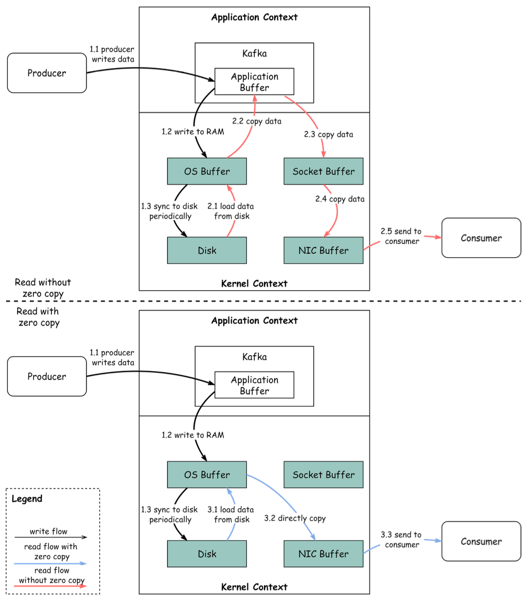

Hey data enthusiasts! Welcome back to the blog. Today, we're diving deep into a technology that's become the backbone of many modern data architectures: **Apache Kafka**. If you've ever wondered how companies like LinkedIn, Netflix, and Uber process a mind-boggling amount of data in real-time – from clicks and logs to financial transactions – chances are Kafka is working its magic behind the scenes.

Originally developed at LinkedIn and open-sourced in 2011, Kafka has evolved from a humble messaging queue into a full-fledged distributed event streaming platform. It's designed to handle high-throughput, low-latency data feeds, making it an indispensable tool for today's data-driven world. So, grab a coffee, and let's unravel what makes Kafka tick!

## What Exactly is Kafka?

At its core, Kafka is a **distributed event store and streaming platform**. Think of it as a super-efficient, highly scalable digital post office designed for massive volumes of messages (or "events"). It allows different software components or applications to communicate with each other by sending and receiving these messages.

Key characteristics that define Kafka:

* **Distributed:** Kafka runs as a cluster of one or more servers (called brokers) that can span multiple data centers or cloud regions. This distributed nature provides fault tolerance and scalability.
* **Event Store:** It durably stores streams of records (events) in categories called topics.
* **Streaming Platform:** Kafka enables the processing of events in real-time as they arrive.

## The "Need for Speed": Why is Kafka So Fast?

Kafka's impressive performance is not accidental; it's a result of smart design choices. Two of the most significant contributors to its speed are **Sequential I/O** and the **Zero Copy Principle**.

### Sequential I/O

Hard drives are much faster at reading and writing data sequentially (one after another) compared to random access (jumping around to different locations). Kafka leverages this by appending messages to log files on disk in a sequential manner. This greatly minimizes disk seek time, which is a major bottleneck in many systems.

### Zero Copy Principle

Traditionally, moving data from a file to a network socket involves multiple copies between kernel space and user space, which consumes CPU cycles and memory bandwidth. Kafka uses the "zero copy" principle on Linux and Unix systems to avoid these redundant copies.

Here's a simplified look at data transfer with and without zero copy:

* **Producer Writes Data:**

  1. The producer writes data to the disk. Data is written to RAM (OS Buffer) and then periodically synced to disk.
* **Consumer Reads Data (Without Zero Copy):**

  1. Data is loaded from disk to the OS cache.
  2. Data is copied from the OS cache to the Kafka application (user space).
  3. The Kafka application copies the data into a socket buffer (kernel space).
  4. Data is copied from the socket buffer to the Network Interface Card (NIC) buffer.
  5. The NIC sends the data to the consumer.
     This involves multiple context switches and data copies.
* **Consumer Reads Data (With Zero Copy):**

  1. Data is loaded from disk to the OS cache.
  2. The OS cache directly copies the data to the NIC buffer using a command like `sendfile()`.
  3. The NIC sends the data out to the consumer.
     This significantly reduces data copies and context switches, leading to approximately a 65% reduction in time.

## Core Concepts in Kafka

To really understand Kafka, let's familiarize ourselves with its key terminology:

* **Messages (or Records/Events):** The basic unit of data in Kafka. A message is like a record in a database table and typically consists of a key, a value, a timestamp, and optional metadata headers.
* **Topics:** A category or feed name to which messages are published. Think of a topic as a folder in a file system, or a table in a database. Messages in a topic are ordered and immutable.
* **Partitions:** Topics are split into multiple partitions. Each partition is an ordered, immutable sequence of messages that is continuously appended to. Partitions allow topics to be parallelized by splitting the data over multiple brokers. Each message within a partition gets an incremental ID called its offset.
* **Producers:** Applications that publish (write) streams of messages to one or more Kafka topics. Producers are responsible for choosing which partition to send a message to, often based on the message key. They also batch messages and handle balancing across partitions.
* **Consumers & Consumer Groups:** Applications that subscribe to (read and process) streams of messages from Kafka topics. Consumers typically operate as part of a **consumer group**. Each message in a topic is delivered to one consumer instance within each subscribing consumer group. This allows for load balancing and fault tolerance among consumers.
* **Brokers:** A Kafka server that runs in a Kafka cluster. Brokers are responsible for storing data. A Kafka cluster is composed of one or more brokers. Each partition is replicated across multiple brokers to ensure high availability and redundancy. One broker acts as the leader for a given partition, and other brokers act as followers.
* **ZooKeeper/KRaft:** Traditionally, Kafka used ZooKeeper for cluster coordination, such as managing broker metadata, controller election, and topic configurations. More recently, KRaft (Kafka Raft Metadata mode) has been introduced, allowing Kafka to manage its metadata without ZooKeeper, simplifying deployment and operations.

## Common Kafka Use Cases

Kafka's versatility makes it suitable for a wide range of applications:

1. **Log Processing and Analysis:** Kafka was originally built for massive log processing. It can collect logs from various sources and feed them into systems like Elasticsearch for analysis and visualization.
2. **Data Streaming in Recommendations:** Used to stream user activities (like clicks) in real-time to recommendation engines or data science platforms.
3. **System Monitoring and Alerting:** Aggregate metrics and events from various systems for real-time monitoring and alerting.
4. **Change Data Capture (CDC):** Capture changes from databases in real-time and stream them to other systems like data warehouses or caches. Debezium with Kafka Connect is a popular solution for this.
5. **System Migration:** Facilitate migrating data from an old system to a new one by streaming data through Kafka, allowing both systems to run in parallel during the transition.
6. **Event Sourcing:** Kafka can act as an event store in event-sourcing architectures, where all changes to application state are stored as a sequence of events.

## Can Kafka Lose Messages? A Sobering Reality

While Kafka is designed for durability and fault tolerance, it's not entirely immune to message loss. Understanding when and how this can happen is crucial for building truly resilient systems.

* **Producer Side:**

  * When a producer sends a message using `producer.send()`, it doesn't go directly to the broker. It involves an application thread, a record accumulator (buffer), and a sender I/O thread.
  * **Mitigation:** Proper configuration of `acks` (acknowledgments) and `retries` is vital.
    * `acks=0`: Producer doesn't wait for acknowledgment (fastest, but highest risk of loss).
    * `acks=1`: Producer waits for the leader broker to acknowledge (default, balanced).
    * `acks=all` (or `-1`): Producer waits for the leader and all in-sync replicas to acknowledge (most durable, but slower).
    * Retries can help handle transient network issues.
* **Broker Side:**

  * A normally functioning cluster shouldn't lose messages. However, extreme situations include:
    * Data is usually flushed to disk asynchronously. If an instance goes down before flushing, messages can be lost.
    * Improper replica configuration or insufficient in-sync replicas (ISR) can lead to data loss if the leader fails.
  * **Mitigation:** Ensure a sufficient replication factor for topics (e.g., 3) and `min.insync.replicas` (e.g., 2) to guarantee that writes are acknowledged only after being replicated to a minimum number of brokers.
* **Consumer Side:**

  * Kafka offers different message commit strategies.
  * Auto-committing offsets can acknowledge messages before they are actually processed. If the consumer crashes mid-processing, those messages might be lost (from a processing perspective).
  * **Mitigation:** Use manual commits. A good practice is to combine synchronous and asynchronous commits: use async commits in the main processing loop for higher throughput and sync commits in exception handling or before shutting down to ensure the last offset is always committed.

## Key Takeaways

* Kafka is a powerful, scalable, and fast distributed streaming platform.
* Its speed comes from techniques like sequential I/O and zero-copy.
* Understanding core concepts like topics, partitions, producers, consumers, and brokers is essential.
* It serves a wide array of use cases, from logging to real-time analytics and CDC.
* While designed for durability, message loss is possible if not configured and managed carefully.

Kafka is a complex system, but its capabilities are transformative for organizations dealing with large-scale data streams.
