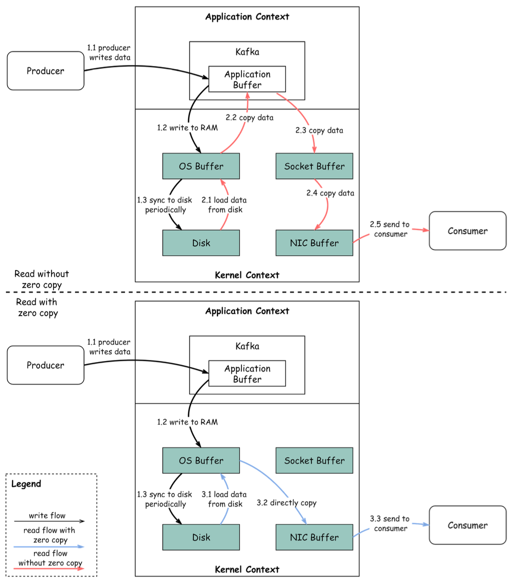

Kafka started at LinkedIn as a way to move log data around and was open-sourced in 2011. It has since become the default backbone for streaming data — clicks, metrics, database changes, transactions — at companies processing millions of events a second. Strip away the ecosystem and it's one idea: a **distributed, append-only log** that many producers write to and many consumers read from independently, each tracking its own position.

This post covers the pieces of that log, the two tricks that make it fast, and the configuration that decides whether a message you sent actually survives.

## The model

- **Event** — the unit of data: a key, a value, a timestamp, and optional headers. Roughly a row.
- **Topic** — a named stream of events, like a table or a folder. Append-only and immutable: you can't update an event, only write a new one.
- **Partition** — a topic is split into partitions, and *this* is where the parallelism comes from. Each partition is an ordered, immutable sequence, and each event in it gets a monotonically increasing **offset**. Different partitions live on different brokers, so a topic's throughput scales with its partition count. Ordering is guaranteed *within* a partition, not across a topic.
- **Producer** — writes events to a topic. It picks the partition, usually by hashing the event key so all events for one key land in order on one partition, and batches writes for throughput.
- **Consumer group** — a set of consumers sharing the work of a topic. Each partition is read by exactly one consumer in the group, so adding consumers (up to the partition count) spreads load. Each group tracks its own offsets, so two groups reading the same topic don't interfere — this is what makes Kafka a log rather than a [traditional message queue](/citadel/interview/message-queue).
- **Broker** — a Kafka server that stores partitions. Each partition is replicated across several brokers; one is the **leader** that handles reads and writes, the others are **followers** that copy it.
- **ZooKeeper / KRaft** — cluster coordination: which broker is the controller, where partitions live, topic configuration. Older clusters use ZooKeeper; newer ones use **KRaft** (Kafka's own Raft-based metadata mode), which drops the ZooKeeper dependency.

## Why it's fast

**Sequential I/O.** Disks — spinning or SSD — are far faster at sequential access than random access, because there's no seek between operations. Kafka only ever *appends* to a partition's log file, so both writes and ordered reads are sequential. A producer's data is written to the OS page cache and flushed to disk in the background.

**Zero-copy.** Normally, sending a file to a network socket copies the data four times: disk → OS page cache → application buffer (user space) → socket buffer (kernel space) → network card buffer, with context switches at each user/kernel boundary. Kafka uses the `sendfile()` system call so the kernel copies straight from the page cache to the network card buffer, skipping the trip through user space entirely. The Kafka broker never touches the message bytes on the read path. That cuts roughly 65% of the transfer time.

## What Kafka is used for

- **Log aggregation** — collect logs from every service and feed them into a search store like Elasticsearch.
- **Activity streaming** — pipe clicks and page views to recommendation and analytics systems in real time.
- **Metrics and alerting** — aggregate events from across the fleet for monitoring.
- **Change data capture** — stream a database's row changes to caches, warehouses, and search indexes (commonly with Debezium and Kafka Connect). See [data pipelining](/citadel/interview/data-pipelining).
- **System migration** — run old and new systems in parallel off the same event stream during a cutover.
- **Event sourcing** — use the log itself as the [system of record](/citadel/interview/event-sourcing), replaying events to rebuild state.

## When Kafka loses messages

Kafka is durable by design, not by default. Loss can happen at all three stages.

**Producer.** `producer.send()` doesn't go straight to a broker — it goes through an in-memory accumulator and a background sender thread. If the process dies with data still buffered, that data is gone. The `acks` setting controls how much confirmation the producer waits for:

- `acks=0` — don't wait at all. Fastest, highest risk.
- `acks=1` — wait for the partition leader to write it. The default; loses data if the leader dies before a follower copies the message.
- `acks=all` — wait for the leader and all in-sync replicas. Most durable, slowest.

Combine `acks=all` with `retries` to ride out transient network failures.

**Broker.** A healthy cluster doesn't lose messages, but: writes are flushed to disk asynchronously, so a broker that crashes before flushing loses the unflushed tail; and if too few replicas are in sync when the leader fails, the promoted replica may be missing recent writes. Mitigate with a replication factor of 3 and `min.insync.replicas=2`, so a write isn't acknowledged until at least two brokers have it.

**Consumer.** If the consumer auto-commits offsets, it can mark a batch "done" before your code has finished processing it. Crash in between and those messages are skipped on restart — lost from the application's point of view, though still on disk. Fix it with manual commits: commit *after* processing, use async commits in the hot loop for throughput, and a synchronous commit in your shutdown and error paths so the last offset is always recorded.

## The takeaway

Kafka is a partitioned log. Partitions buy parallelism and cost you cross-topic ordering; sequential I/O and zero-copy buy throughput; and durability is a dial you set with `acks`, `min.insync.replicas`, and manual offset commits — not something you get for free. Decide how much loss each stage can tolerate before you decide the settings.
