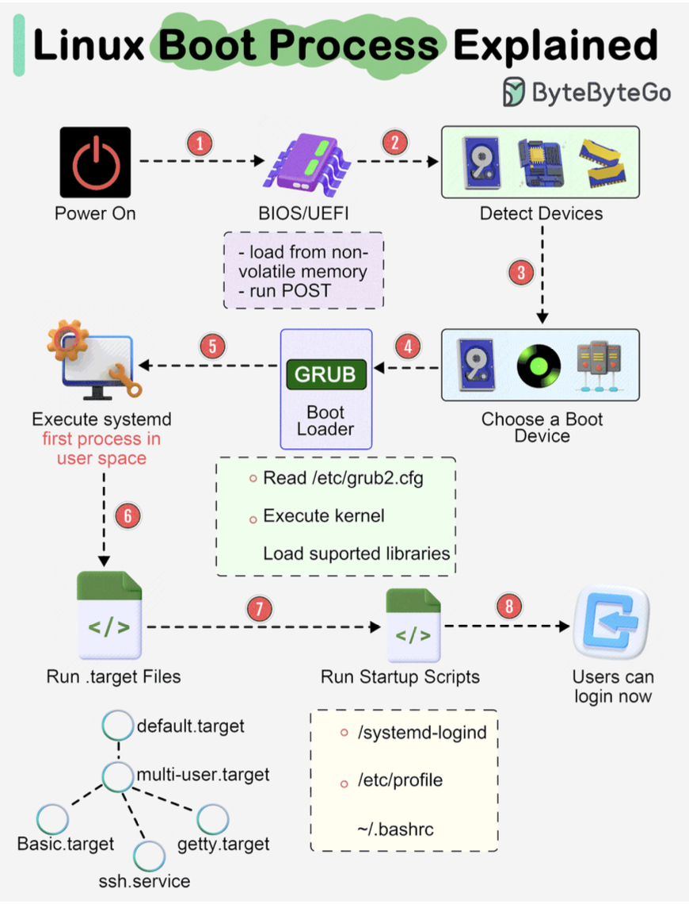
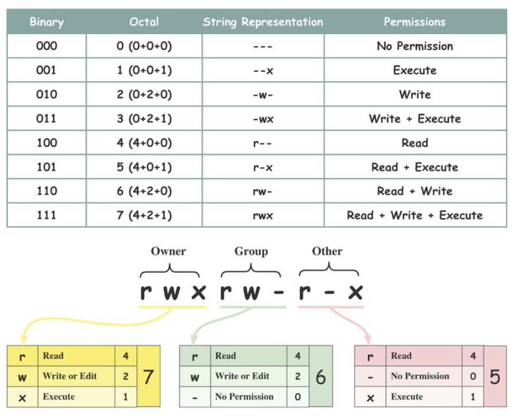
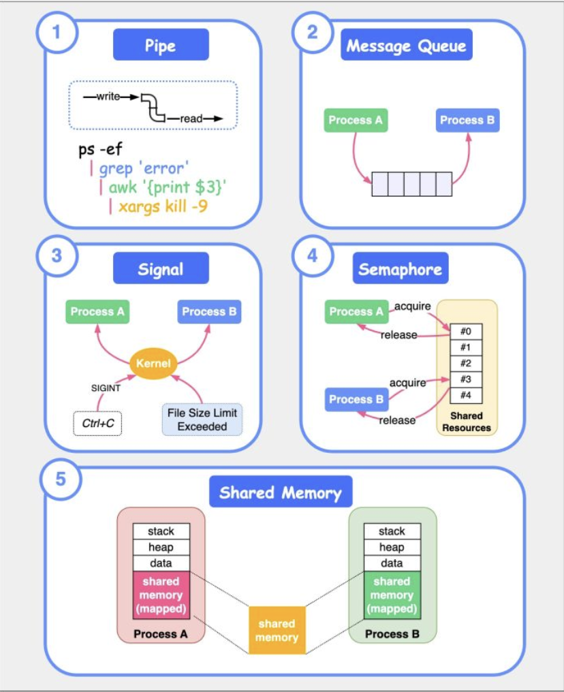
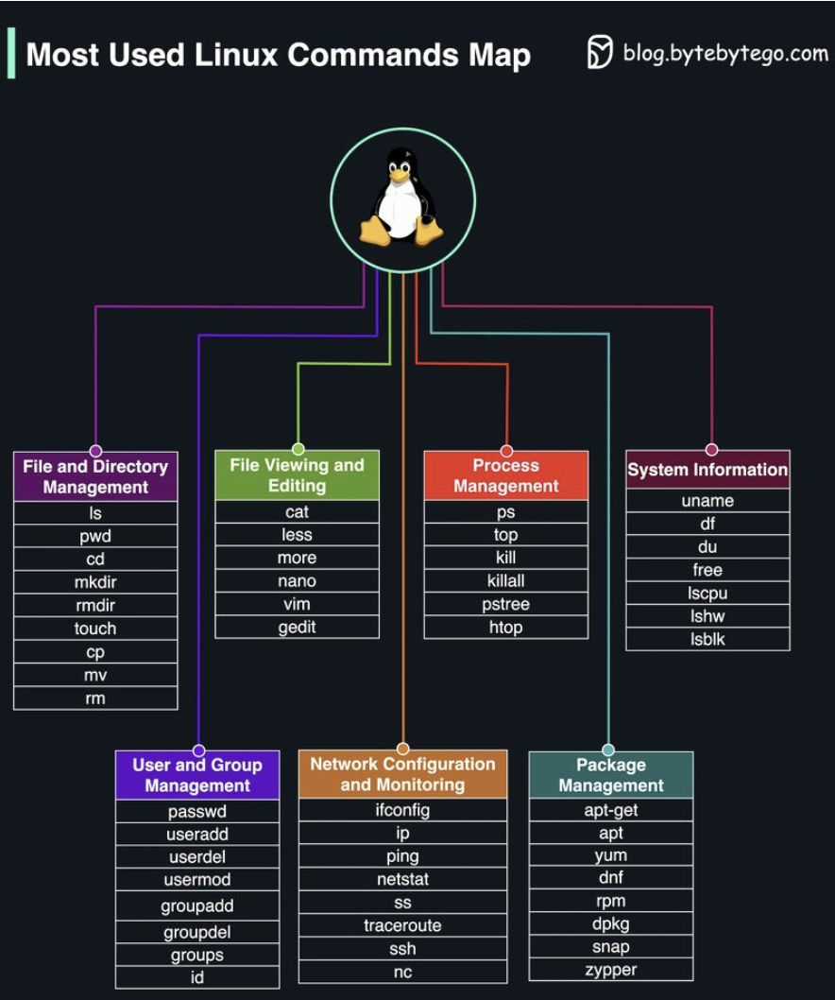
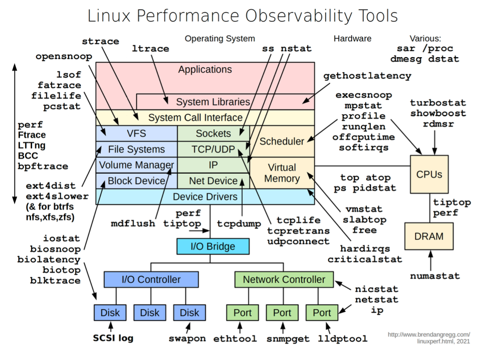

Hey tech explorers and command-line adventurers! Today, we're setting sail into the vast and versatile world of **Linux**. Whether you're a seasoned sysadmin, a budding developer, or just curious about what powers a significant chunk of the internet, servers, supercomputers, and even your Android phone, understanding Linux is a valuable endeavor.

Linux, at its heart, is an open-source operating system kernel that has profoundly impacted the world of computing. In fact, it's often cited as one of the open-source projects that truly changed the world. Its stability, flexibility, and community-driven development have made it a favorite for a myriad of applications. Let's unpack some of its core concepts.

## What is Linux? A Quick Overview

Linux is a Unix-like operating system kernel first released by Linus Torvalds in 1991. Unlike proprietary operating systems, its source code is open and available for anyone to use, modify, and distribute. This openness has led to the creation of thousands of different Linux distributions (or "distros") like Ubuntu, Fedora, Debian, and CentOS, each tailored for specific needs.

## The Linux Boot Process: From Power-On to Prompt

Ever wondered what happens when you fire up a Linux machine? The boot process is a fascinating sequence of events:

1. **BIOS/UEFI Initialization:** When you turn on the power, the system's firmware—either BIOS (Basic Input/Output System) or the more modern UEFI (Unified Extensible Firmware Interface)—springs to life. It's loaded from non-volatile memory and performs a POST (Power-On Self-Test) to check basic hardware.
2. **Device Detection:** The BIOS/UEFI then detects connected devices like the CPU, RAM, and storage drives.
3. **Boot Device Selection:** It identifies and selects a boot device (e.g., hard drive, SSD, network server, or CD-ROM) from which to load the operating system.
4. **Boot Loader (GRUB):** The firmware runs the boot loader, commonly GRUB (Grand Unified Bootloader). GRUB presents a menu if multiple OSes are present or loads the default kernel. It reads its configuration (e.g., from `/etc/grub2.cfg`) and then loads the selected Linux kernel into memory and executes it.
5. **Kernel Initialization & systemd/init:** Once the kernel is loaded and running, it takes control. The kernel initializes hardware, mounts the root filesystem, and then starts the first user-space process. In modern Linux systems, this is usually `systemd` (which has largely replaced the older `init` process). `systemd` manages system processes, services, probes remaining hardware, mounts filesystems, and can launch a desktop environment.
6. **Target Units/Runlevels:** `systemd` activates target units (similar to runlevels in older init systems). For example, `multi-user.target` typically starts a non-graphical multi-user system, while `graphical.target` would start a graphical desktop.
7. **Startup Scripts & Login:** The system runs various startup scripts and configures the environment. Eventually, users are presented with a login prompt or a graphical login window, and the system is ready for use.

## Navigating the Labyrinth: The Linux File System Hierarchy

The Linux file system might initially seem like a maze of cryptic three-letter directories. However, there's a method to this madness, largely defined by the **Filesystem Hierarchy Standard (FHS)**. Introduced around 1994, the FHS aims to provide a consistent layout across different Linux distributions, ensuring that software can find files and directories in predictable locations. While not all distributions adhere strictly, most follow it closely.

Here's a peek at some key directories starting from the root (`/`):

* `/bin`: Essential user command binaries (e.g., `ls`, `cp`, `cat`).
* `/boot`: Static files for booting the system, including the kernel and initial RAM disk.
* `/dev`: Device files representing hardware.
* `/etc`: Host-specific system-wide configuration files.
* `/home`: User home directories.
* `/lib`: Essential shared libraries and kernel modules.
* `/media`: Mount points for removable media like CD-ROMs.
* `/mnt`: Temporary mount point for a mounted filesystem.
* `/opt`: Add-on application software packages.
* `/proc`: A virtual filesystem providing an interface to kernel data structures and process information. It's automatically generated.
* `/root`: Home directory for the root user.
* `/run`: Run-time variable data; information about the running system since last boot.
* `/sbin`: Essential system binaries (e.g., `reboot`, `fdisk`).
* `/srv`: Site-specific data served by this system.
* `/sys`: A virtual filesystem that provides information about the system, devices, and drivers.
* `/tmp`: Temporary files.
* `/usr`: Multi-user utilities and applications (Unix System Resources). Contains read-only user files.
* `/var`: Variable files — files whose content is expected to continually change during normal operation of the system—such as logs, spool files, and temporary e-mail files.

You can explore these using commands like `cd` for navigation and `ls` for listing contents.

## Permissions and Ownership: Controlling Access

Security in Linux heavily relies on file permissions and ownership.

* **Ownership:** Every file and directory is assigned three types of owners:
  * **Owner (User):** The user who created the file or directory.
  * **Group:** A collection of users who share the same access permissions for a file/directory.
  * **Other:** Any user who is not the owner and does not belong to the group.
* **Permissions:** There are three basic types of permissions that can be assigned to each owner category:
  * **Read (r):** Allows viewing the contents of a file or listing the contents of a directory.
  * **Write (w):** Allows modifying or deleting a file, or creating/deleting files within a directory.
  * **Execute (x):** Allows running a file as a program or script, or accessing (entering) a directory.
    The `chmod` command is commonly used to change these permissions.

## Core Components of Linux: Under the Hood

Linux is a complex system with several major components working together:

1. **System:** This layer includes system APIs, device drivers for hardware interaction, I/O management, and system buses.
2. **Memory Management:** Handles physical memory, virtual memory, memory mappings, and object allocation to ensure processes have the memory they need.
3. **Process Management:** Responsible for process scheduling (deciding which process runs when), handling interrupts, managing threads, and synchronization between processes.
4. **Network Stack:** Manages network communications through protocols (TCP/IP, UDP), sockets, and Network Interface Card (NIC) drivers.
5. **Storage Management:** Includes file systems (like ext4, XFS, Btrfs), I/O caches to speed up disk access, and management of various storage devices. The Linux Storage Stack Diagram illustrates the layers involved here.

## Talking Amongst Themselves: Inter-Process Communication (IPC)

Processes often need to communicate with each other. Linux provides several IPC mechanisms:

* **Pipes:** Unidirectional byte streams connecting the standard output of one process to the standard input of another.
* **Message Queues:** Allow one or more processes to write messages that can be read by one or more other processes.
* **Signals:** One of the oldest IPC methods; used to notify a process of an event, like a keyboard interrupt (Ctrl+C sends SIGINT) or an error.
* **Semaphores:** A synchronization primitive used to control access to shared resources by multiple processes.
* **Shared Memory:** Allows multiple processes to share a region of memory, providing a very fast way to exchange data.

## Commanding Your Linux System: Essential Tools

Interacting with Linux is primarily done via commands in a terminal. Knowing some basic commands is essential:

* `ls`: List files and directories.
* `cd`: Change current directory.
* `mkdir`: Create a new directory.
* `rm`: Remove files or directories.
* `cp`: Copy files or directories.
* `mv`: Move or rename files or directories.
* `grep`: Search for a pattern in files.
* `find`: Search for files or directories.
* `cat`: Display the content of files.
* `vi` or `nano`: Text editors.
* `ps`: Display process information.
* `top`: Display process and resource usage dynamically.
* `kill`: Terminate a process.
* `ifconfig` (older) or `ip`: Configure network interfaces.
* `ping`: Test network connectivity.
* `du`: Estimate file space usage.
* `tar`: Manipulate tarball archive files.

## Troubleshooting and Performance: Observability Tools

When things go wrong or systems slow down, Linux offers a suite of tools to diagnose issues related to CPU, memory, I/O, etc.. Some key observability tools include:

* `'vmstat'`: Reports information about processes, memory, paging, block IO, traps, and CPU activity.
* `'iostat'`: Reports CPU and input/output statistics of the system.
* `'netstat'`: Displays statistical data related to IP, TCP, UDP, and ICMP protocols.
* `'lsof'`: Lists open files of the current system.
* `'pidstat'`: Monitors the utilization of system resources by all or specified processes, including CPU, memory, device IO, task switching, threads, etc..

## Key Takeaways

* Linux is a powerful, open-source operating system kernel that underpins a vast amount of modern technology.
* Its boot process is a well-defined sequence ensuring the system starts correctly.
* The Filesystem Hierarchy Standard (FHS) brings order to its directory structure.
* File permissions and ownership are fundamental to its security model.
* Core components manage everything from processes and memory to networking and storage.
* A rich set of commands and observability tools allow for effective interaction and troubleshooting.

Linux is a deep and fascinating operating system. The more you learn, the more you realize there is to discover!
