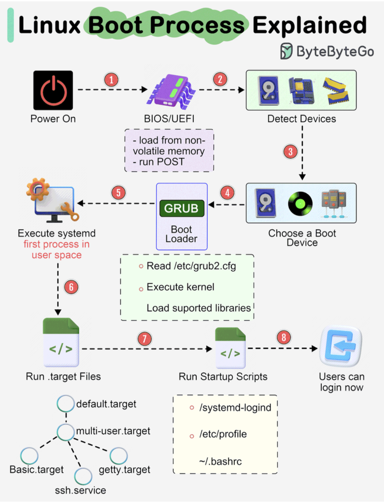
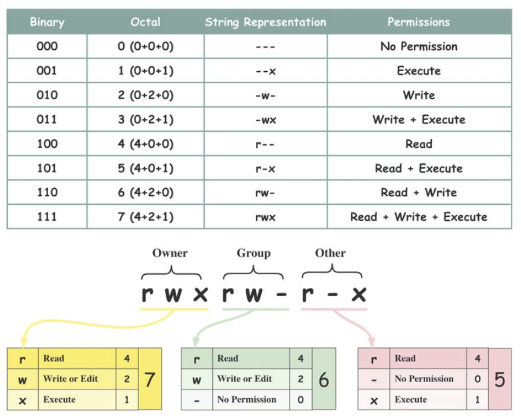
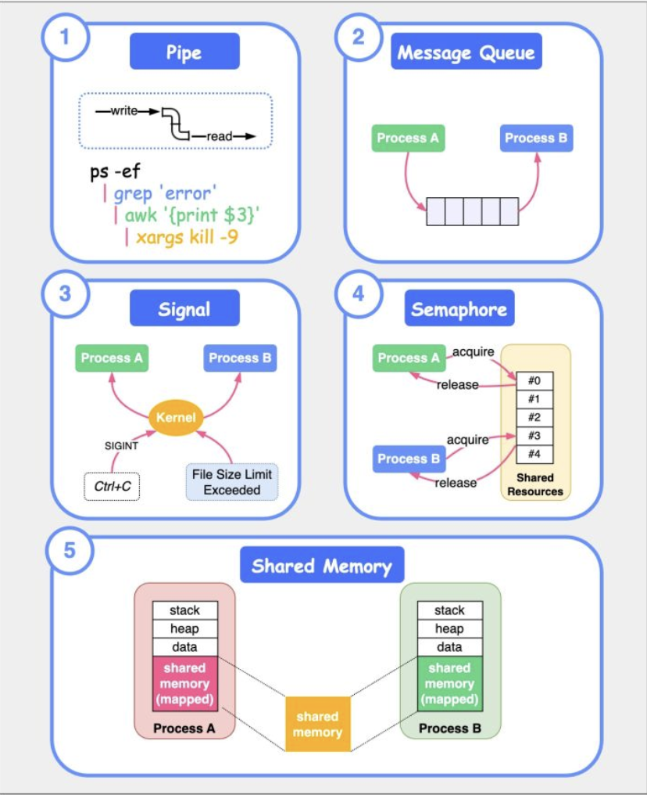
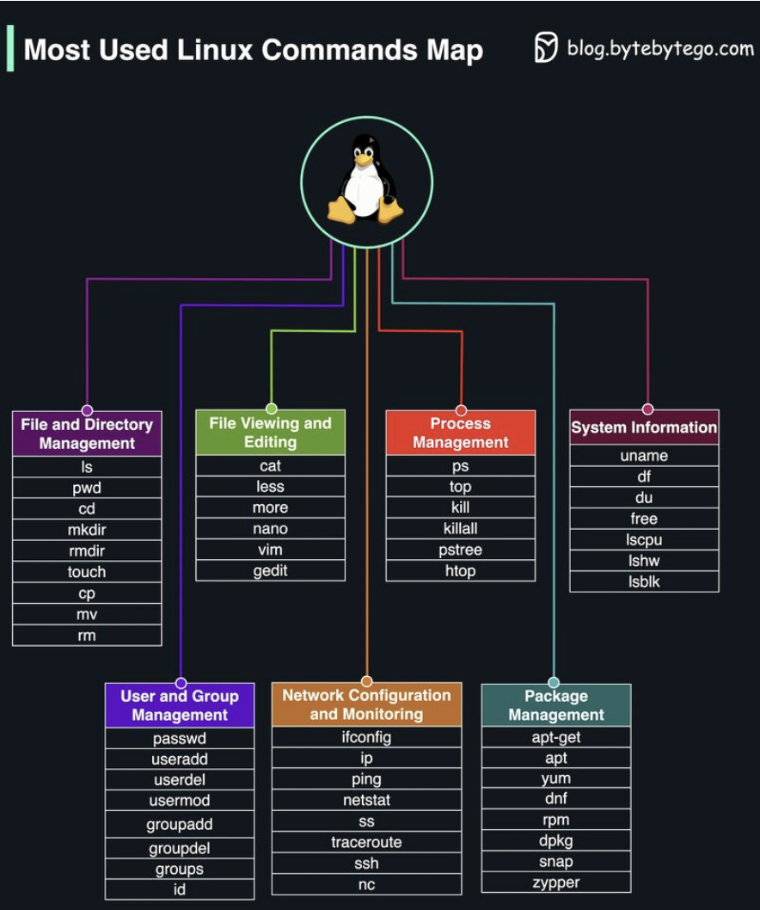
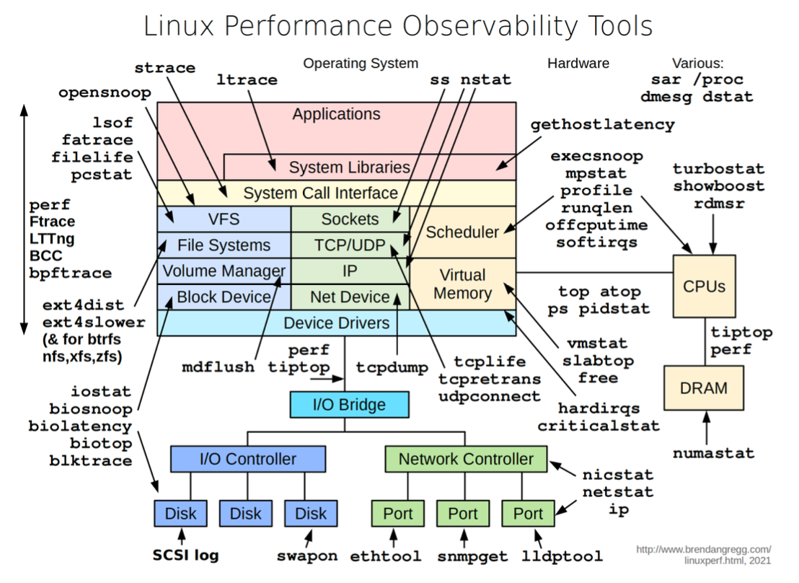

Linux is a Unix-like operating system kernel that Linus Torvalds first released in 1991. Because it's open source, it ships in thousands of distributions — Ubuntu, Debian, Fedora, and the rest — that differ in packaging and defaults but share the same kernel and, mostly, the same layout.

This post is a tour of the parts you touch as a developer or operator: the boot sequence, the directory tree, the permission model, and the five subsystems the kernel runs — each paired with the commands that go with it.

## Boot: power button to prompt

1. **Firmware (BIOS or UEFI)** runs from non-volatile memory and does a POST (power-on self-test) to check basic hardware.
2. **Device detection** — the firmware enumerates the CPU, RAM, and drives.
3. **Boot device selection** — it picks where to boot from: a disk, an SSD, the network, removable media.
4. **Bootloader (GRUB)** — the firmware runs GRUB, which reads its config, optionally shows an OS menu, then loads the selected kernel into memory and jumps to it.
5. **Kernel init** — the kernel brings up hardware, mounts the root filesystem, and starts the first user-space process, `systemd` (which replaced the older `init`).
6. **Target units** — `systemd` activates a *target* (the modern equivalent of a runlevel): `multi-user.target` for a headless system, `graphical.target` to also start a desktop.
7. **Startup and login** — startup units run, the environment is configured, and you get a text or graphical login.

## The filesystem hierarchy

The tree of three-letter directories under `/` isn't arbitrary — it follows the **Filesystem Hierarchy Standard** (FHS, from around 1994), so software can rely on files being in predictable places across distributions.

| Path | Holds |
| --- | --- |
| `/bin`, `/sbin` | Essential binaries — user commands (`ls`, `cp`) and system ones (`reboot`, `fdisk`) |
| `/boot` | The kernel and initramfs |
| `/dev` | Device files |
| `/etc` | Host-specific system configuration |
| `/home`, `/root` | User home directories, and root's |
| `/lib` | Shared libraries and kernel modules |
| `/proc`, `/sys` | Virtual filesystems exposing kernel and process state — generated on the fly, not on disk |
| `/tmp`, `/run` | Temporary files; runtime state since last boot |
| `/usr` | Read-only user programs and data (the bulk of an install) |
| `/var` | Data that changes constantly — logs, spools, mail, caches |
| `/mnt`, `/media`, `/opt`, `/srv` | Manual mounts; removable media; add-on software; served data |

## Permissions and ownership

Every file and directory has an **owner** (a user), a **group**, and everyone else (**other**). For each of those three classes, three permission bits:

- **Read (`r`)** — view a file's contents, or list a directory.
- **Write (`w`)** — modify or delete a file, or create and remove entries in a directory.
- **Execute (`x`)** — run a file as a program, or `cd` into (traverse) a directory.

`chmod` sets the bits, `chown` sets the owner and group. The directory case trips people up: you need `x` on a directory to reach anything inside it, even files you have `r` on.

## What the kernel manages

Five subsystems:

1. **System interface** — system calls, device drivers, and bus handling: the boundary between user programs and hardware.
2. **Memory management** — physical RAM, virtual address spaces, memory-mapped files, and allocation. The [memory hierarchy](/citadel/interview/computer-memories) it's managing runs from registers to disk.
3. **Process management** — scheduling (which [process or thread](/citadel/interview/process-thread) runs next), interrupt handling, and synchronisation primitives.
4. **Network stack** — TCP/IP and UDP, [sockets](/citadel/interview/socket-program), and NIC drivers.
5. **Storage** — filesystems (ext4, XFS, Btrfs), the page cache that buffers disk I/O, and block device handling. The [storage models](/citadel/interview/storage-systems) — block, file, object — sit on top of this.

[Containers](/citadel/tech/docker) are these subsystems used deliberately: namespaces partition the process, network, and mount views; cgroups cap the memory and CPU a group of processes can use.

## Inter-process communication

- **Pipes** — a one-way byte stream, typically one process's stdout into another's stdin.
- **Message queues** — processes post discrete messages that others read.
- **Signals** — the oldest mechanism: a small notification of an event (`Ctrl+C` sends `SIGINT`).
- **Semaphores** — a counter used to coordinate access to a shared resource.
- **Shared memory** — a region mapped into multiple processes for fast data exchange, usually paired with a semaphore for synchronisation.

## Commands and observability

The everyday set: `ls`, `cd`, `mkdir`, `rm`, `cp`, `mv` for files; `grep`, `find`, `cat` for searching and reading; `ps`, `top`, `kill` for processes; `ip` (or the older `ifconfig`) and `ping` for the network; `du` and `tar` for space and archives; `vi` or `nano` to edit.

When something is slow, each subsystem has a tool:

- `vmstat` — processes, memory, paging, block I/O, and CPU activity at a glance.
- `iostat` — CPU and per-device I/O statistics.
- `netstat` — IP, TCP, UDP, and ICMP counters.
- `lsof` — every open file on the system (and sockets, which are files).
- `pidstat` — per-process CPU, memory, I/O, context switches, and thread counts.

## The takeaway

Linux is a kernel that manages five things — the hardware interface, memory, processes, the network, and storage — and a userland arranged by a standard so tools can find what they need. Almost every command and diagnostic maps onto one of those five subsystems; knowing which one your problem is in tells you which tool to open.
