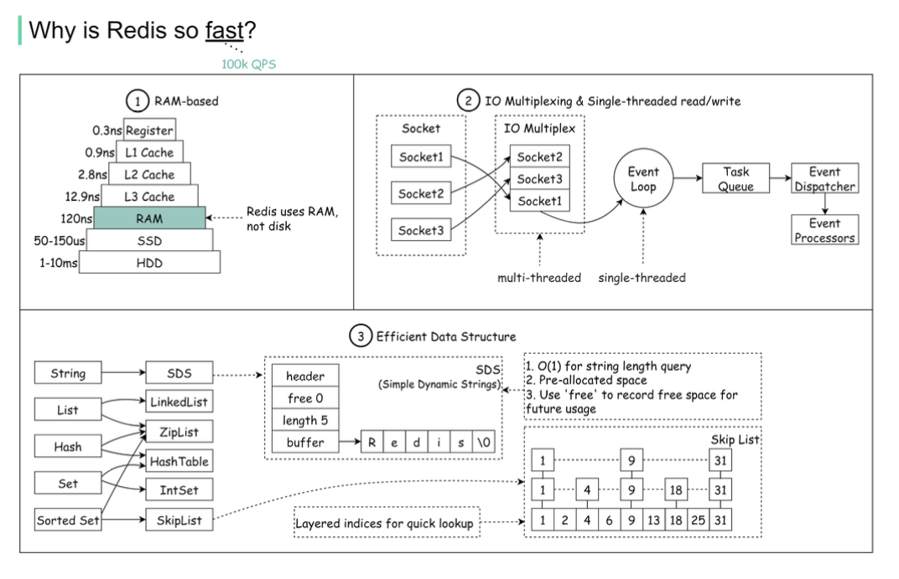
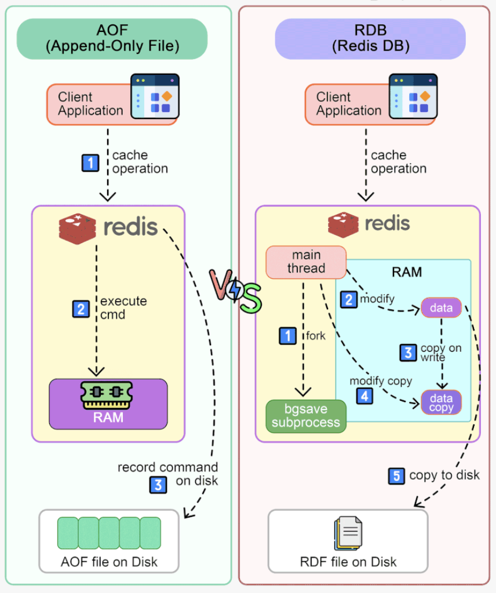

Hey everyone, and welcome back to the blog! If you've been anywhere near web development or high-performance systems, you've undoubtedly heard of **Redis**. Often lauded for its incredible speed, Redis is an open-source, in-memory data structure store, used as a database, cache, message broker, and streaming engine. But what makes it so fast? And what else can it do besides simple caching?

Today, we're taking a closer look at Redis, exploring the reasons for its performance, its rich set of data structures, how it handles data persistence, and how its architecture has evolved to meet growing demands. Let's dive in!

## What's the Secret to Redis's Speed?

Redis is renowned for its low-latency performance, often serving requests in microseconds. This isn't just magic; it's a combination of smart design choices:

1. **RAM-Based Storage:** The primary reason Redis is so fast is that it keeps data in RAM (Random Access Memory). Accessing data from RAM is orders of magnitude faster than accessing it from a disk (SSD or HDD). For instance, RAM access can be around 100 nanoseconds, while SSD access is closer to 100 microseconds, and disk seeks can take milliseconds.
2. **I/O Multiplexing and Single-Threaded Execution Loop:** Redis uses an event-driven model with I/O multiplexing. This allows it to handle many client connections simultaneously with a single thread for executing commands. This single-threaded nature for command execution avoids the overhead and complexity of locks and context switching between threads for reads and writes. More recent versions (like Redis 6.0) have introduced multi-threaded I/O for handling network operations, further boosting performance by offloading I/O tasks from the main event loop.
3. **Efficient Data Structures:** Redis isn't just a simple key-value store; it provides optimized low-level data structures. Instead of reinventing the wheel with high-level abstractions, Redis exposes these powerful structures directly, like Simple Dynamic Strings (SDS), ziplists, skiplists, etc., which are tailored for performance.

## Redis's Toolbox: Versatile Data Structures

One of Redis's standout features is its support for a variety of data structures, each suited for different use cases. This makes it far more flexible than a traditional cache that might only support string key-value pairs.

Here are some of the main ones:

* **Strings:** The most basic Redis type. Can store text, serialized objects, or binary data up to 512MB.
* **Lists:** A list of strings, sorted by insertion order. Think of them as linked lists. Ideal for implementing queues or stacks.
* **Sets:** An unordered collection of unique strings. Useful for tracking unique items, like unique visitors to a webpage.
* **Sorted Sets (ZSETs):** Similar to Sets, but each member is associated with a score. Members are ordered by their score, allowing for fast range queries and ranking. Great for leaderboards or priority queues. A common use case is sorting commented user lists and deduplicating users.
* **Hashes:** Store collections of field-value pairs, essentially objects. Perfect for storing structured data like user profiles. You can use hashes for recording the number of clicks and comments for each post.
* **Bitmaps (via String commands):** Allow you to perform bitwise operations. Useful for space-efficient tracking of boolean information for a very large number of items, like user login status or feature flags.
* **HyperLogLogs (HLLs):** A probabilistic data structure used to estimate the cardinality (number of unique elements) of a set with very low memory usage.
* **Streams:** An append-only log data structure, similar to Kafka topics. Great for event sourcing or real-time data ingestion.
* **Geospatial Indexes:** Store longitude and latitude data and query for items within a certain radius. Useful for finding nearby locations.

Redis also supports server-side scripting with Lua, allowing you to perform atomic operations directly inside Redis.

## Keeping Your Data: Redis Persistence

Since Redis is primarily an in-memory database, what happens if the server restarts or crashes? Your data would be lost!  To prevent this, Redis offers a couple of persistence mechanisms:

### 1. RDB (Redis Database Backup)

* RDB creates point-in-time snapshots of your dataset at specified intervals.
* When Redis needs to persist data using RDB, the main thread forks a child process (using `bgsave`). This child process then writes the data to a temporary RDB file.
* Redis uses a copy-on-write mechanism. If the main thread modifies data while the `bgsave` is in progress, a copy of the data is made, and the main thread operates on this copy, while the child process continues to write the original data to the RDB file.
* RDB files are compact and good for backups. Loading an RDB file on startup is generally faster than replaying an AOF file.

### 2. AOF (Append Only File)

* AOF logs every write operation received by the server. These operations are replayed at startup to reconstruct the dataset.
* Interestingly, Redis AOF is a "write-after log," meaning Redis executes commands to modify data in memory *first* and then writes the command to the AOF. This prevents the AOF logging from blocking the current write operation.
* AOF offers different fsync policies:
  * `no`: Don't fsync, let the OS handle it. Fastest, but least safe.
  * `everysec`: Fsync every second (default). Good balance of performance and durability.
  * `always`: Fsync after every write. Slowest, but most durable.
* AOF logs can grow large. Redis supports automatic rewriting of the AOF file in the background to keep its size manageable.
* A potential drawback is that if the AOF log is very large, recovery can take longer than loading an RDB snapshot.

### Mixed Persistence

It's common in production to use both RDB and AOF. RDB can be used for periodic backups, while AOF provides more fine-grained durability by logging commands between snapshots.

## The Evolution of Redis Architecture

Redis hasn't stood still; its architecture has evolved to meet the growing needs of its users:

* **2010 - Standalone Redis:** In its initial release (Redis 1.0), it was often used as a simple cache alongside a business application. The main risk was data loss on restart.
* **2013 - Persistence (Redis 2.8):** Addressed data loss with RDB snapshots and AOF logging.
* **2013 - Replication (Redis 2.8):** Introduced primary-replica replication to increase availability. The primary handles writes, and data is synchronized to replicas.
* **2013 - Sentinel (Redis 2.8):** Sentinel was added to monitor Redis instances, provide notifications, handle automatic failover, and act as a configuration provider.
* **2015 - Redis Cluster (Redis 3.0):** This was a major step, introducing a distributed database solution with automatic sharding. Data is divided into 16,384 hash slots, distributed across multiple nodes.
* **Looking Ahead:** Redis continues to evolve. Redis 5.0 (2017) added the Stream data type, and Redis 6.0 (2020) introduced multi-threaded I/O in the network module to address potential bottlenecks there.

## Redis vs. Memcached: A Quick Glance

Another popular in-memory key-value store is Memcached. Here's how they generally compare:

| Feature                   | Memcached                         | Redis                                                                                       |
| :------------------------ | :-------------------------------- | :------------------------------------------------------------------------------------------ |
| **Data Structures** | Plain string values               | Rich data types: lists, sets, sorted sets, hashes, bitmaps, HLLs, streams, geospatial, etc. |
| **Architecture**    | Multi-threaded                    | Single-threaded for command execution; multi-threaded I/O in newer versions                 |
| **Persistence**     | No built-in persistence           | RDB and AOF persistence                                                                     |
| **Replication**     | No native server-side replication | Leader-follower replication                                                                 |
| **Transactions**    | No                                | Supports atomic operations and transactions (MULTI/EXEC)                                    |
| **Pub/Sub**         | No                                | Supports Pub/Sub messaging                                                                  |
| **Geospatial**      | No                                | Supports geospatial indexes                                                                 |
| **Server-side Lua** | No                                | Supports Lua scripting                                                                      |

While Memcached is simpler and can be very fast for basic caching, Redis's rich feature set makes it suitable for a much broader range of use cases.

## Key Takeaways

* Redis achieves its remarkable speed through RAM-based storage, an efficient single-threaded event loop (with multi-threaded I/O for networking), and optimized data structures.
* It offers a rich set of data structures beyond simple key-value strings, enabling diverse applications.
* Persistence via RDB snapshots and AOF logging helps protect against data loss.
* Redis architecture has evolved from standalone to include replication, Sentinel for high availability, and Cluster for distributed sharding.

Redis is a powerful and versatile tool in any developer's arsenal, far more than just a simple cache.
