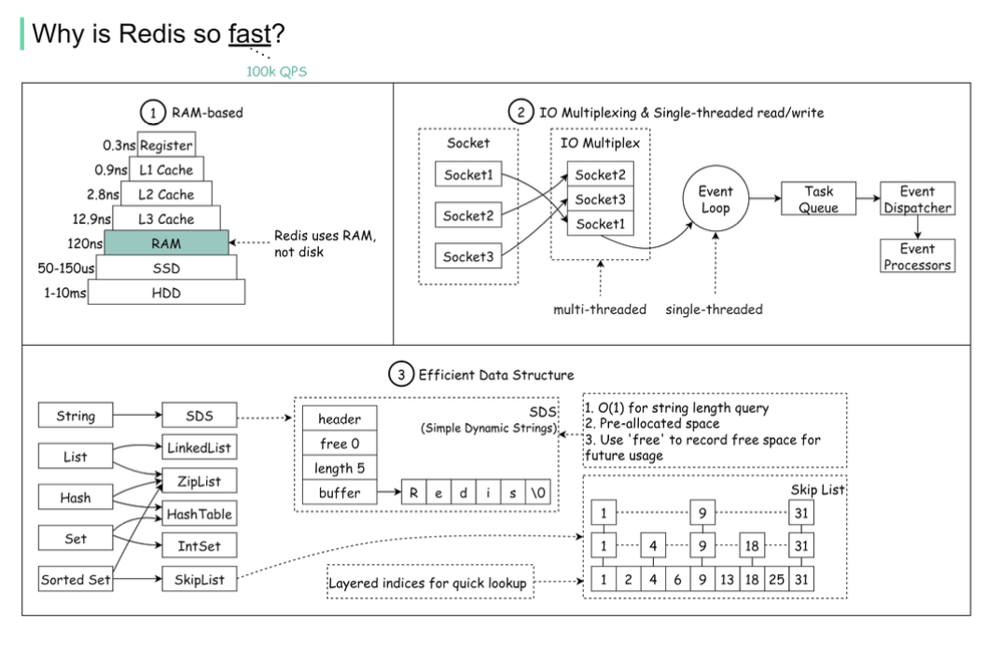
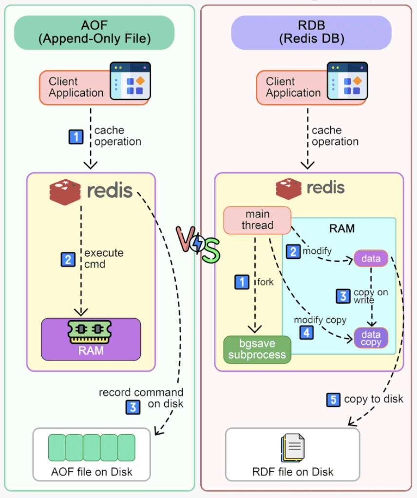

Redis usually shows up in a stack as "the cache" — the fast thing in front of the slow database. It does that job well, but calling it a cache undersells it: Redis is an in-memory data structure store that also works as a database, a message broker, and a stream log. What makes it fast is worth understanding, because the same three reasons explain what it's good and bad at.

This post covers why Redis serves requests in microseconds, the data structures it exposes, how it avoids losing everything on restart, and how its architecture grew from a single process into a sharded cluster.

## Why it's fast

Three design choices, in order of impact:

1. **Data lives in RAM.** Reading from memory takes roughly 100 nanoseconds; an SSD read is closer to 100 microseconds and a spinning disk seek is milliseconds. That's a thousandfold gap before anything else, and it's why the [latency numbers every engineer should know](/citadel/random-thoughts/latency-number) put memory and disk in different weight classes.
2. **One thread runs commands.** Redis uses I/O multiplexing (`epoll` and friends) to watch thousands of client connections from a single event loop, and executes commands one at a time on one thread. No locks, no context switches, no coordinating concurrent writes to the same key. Redis 6.0 added multi-threaded *network I/O* — reading and writing sockets — but command execution stays single-threaded.
3. **The data structures are tuned.** Redis doesn't build generic objects; it ships low-level structures picked for the job — simple dynamic strings, ziplists, skiplists — and switches encodings based on size.

The single thread is also the main constraint: one slow command (a `KEYS *` on a large dataset, a big `SORT`) blocks every other client until it finishes.

## Nine data structures

This is what separates Redis from a plain key-value cache. Each type has operations built into the server, so you manipulate data in place instead of reading it out, changing it, and writing it back.

- **Strings** — text, a serialised object, or binary, up to 512 MB.
- **Lists** — ordered by insertion, like a linked list. Queues and stacks.
- **Sets** — unordered, unique members. Tracking unique visitors.
- **Sorted sets (ZSETs)** — every member has a score; members stay ordered by it. Leaderboards, priority queues, range-by-rank queries.
- **Hashes** — field-value pairs under one key: an object. User profiles; per-post view and comment counts.
- **Bitmaps** — bitwise operations on a string. Space-cheap boolean state for millions of items: who's logged in, which feature flags are on.
- **HyperLogLog** — a probabilistic cardinality estimator: count unique elements in kilobytes instead of gigabytes, accepting a small error.
- **Streams** — an append-only log, much like a [Kafka](/citadel/tech/kafka) topic, with consumer groups. Event sourcing, ingestion.
- **Geospatial indexes** — store longitude/latitude and query by radius. "What's near me."

Server-side **Lua scripting** runs a block of commands atomically on the single thread.

## Persistence: RDB and AOF

Redis holds data in memory, so a crash or restart loses it unless it's been written to disk. There are two mechanisms.

**RDB (snapshots).** At configured intervals, Redis takes a point-in-time dump of the whole dataset. The main thread `fork()`s a child process (`bgsave`); the child writes the snapshot while the parent keeps serving. They share memory copy-on-write, so only pages the parent modifies during the save get duplicated. RDB files are compact, ideal for backups, and load faster on startup than replaying a log. The cost: you lose everything written since the last snapshot.

**AOF (append-only file).** Redis logs every write command to a file and replays it on startup. It's a *write-after* log — the command runs in memory first, then gets appended — so logging never blocks the write. You choose the `fsync` policy:

- `no` — let the OS flush when it wants. Fastest, least safe.
- `everysec` — flush once a second. The default; at most one second of writes at risk.
- `always` — flush after every write. Safest, slowest.

The AOF grows without bound, so Redis periodically rewrites it into the shortest command sequence that rebuilds the current state. A large AOF makes recovery slower than loading an RDB.

**In production, most run both**: RDB for periodic backups, AOF for fine-grained durability between snapshots.

## How the architecture grew

- **2010, standalone (1.0)** — one process, used as a cache beside the app. A restart loses the data.
- **2013, persistence (2.8)** — RDB and AOF close the data-loss gap.
- **2013, replication (2.8)** — a primary takes writes and streams them to replicas, which serve reads. See the [read-replica pattern](/citadel/interview/read-replica-pattern).
- **2013, Sentinel (2.8)** — monitors instances, notifies, and performs automatic failover by promoting a replica when the primary dies.
- **2015, Cluster (3.0)** — data is split across nodes over 16,384 hash slots, giving horizontal [sharding](/citadel/interview/data-sharding) with automatic slot assignment.
- **2017, Streams (5.0)** and **2020, multi-threaded I/O (6.0)** — the log data type, and network I/O parallelism to relieve the one bottleneck the single command thread couldn't.

## Redis vs Memcached

| Feature | Memcached | Redis |
| --- | --- | --- |
| Data types | Strings only | Strings, lists, sets, sorted sets, hashes, bitmaps, HLL, streams, geo |
| Threading | Multi-threaded | Single-threaded command execution; multi-threaded network I/O since 6.0 |
| Persistence | None | RDB and AOF |
| Replication | None built in | Leader-follower |
| Transactions | No | `MULTI`/`EXEC` |
| Pub/Sub | No | Yes |

Memcached is simpler and its multi-threaded model can edge Redis on pure key-value throughput with large values. Redis wins everywhere the richer types, persistence, or replication matter — which is most places. When you use it as a cache, the [usual caching pitfalls](/citadel/interview/cache-pitfalls) still apply: stampedes, stale data, and the thundering herd on expiry.

## The takeaway

Redis is fast for three compounding reasons — memory, a single command thread, tuned structures — and each one is also a limit. It's not a general database you can run any query against; it's a set of fast primitives you design your access patterns around. When your data fits in RAM and your operations map onto its structures, nothing beats it. When they don't, that's what the [real database](/citadel/random-thoughts/right-db) is for.
